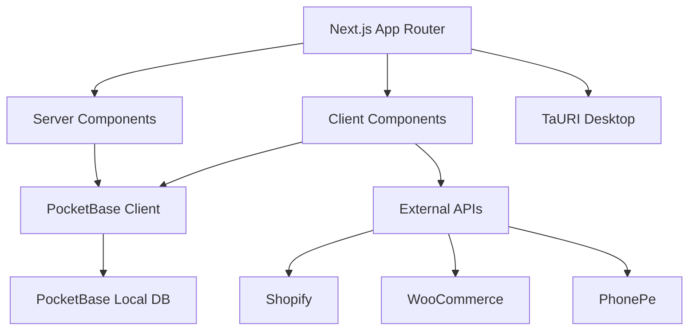

# Luminila Inventory Management - Comprehensive Audit Report

**Date:** February 26, 2026  
**Auditor:** Kilo Code  
**Project Version:** 0.1.0  
**Repository:** luminila_inv_mgmt

---

## 1. Executive Summary

This comprehensive audit identifies **47+ critical, high, medium, and low priority issues** across the Luminila Inventory Management system. The project has recently migrated from Supabase to PocketBase but suffers from significant technical debt, incomplete migrations, security vulnerabilities, and configuration inconsistencies that require immediate attention.

The system serves as a multi-channel inventory management solution for fashion jewelry brands, with features including Point of Sale (PoS), e-commerce integrations, and barcode management. However, the codebase exhibits numerous reliability, security, and maintainability concerns.

| Severity | Count | Status |
|----------|-------|--------|
| 🔴 Critical | 8 | Immediate Action Required |
| 🟠 High | 15 | Fix Before Release |
| 🟡 Medium | 18 | Should Fix |
| 🟢 Low | 6 | Nice to Have |

---

## 2. Project Structure and Documentation Issues

### 2.1 Inconsistent Backend Strategy

**Impact:** Confusing architecture, maintenance burden  
**Files:** `README.md`, `env.example.txt`, `.env.local`

The project documentation still references Supabase as the primary backend, while the actual code uses PocketBase. This creates significant confusion for developers and maintainers.

**Issues:**

- README mentions Supabase but code uses PocketBase
- `.env.local` still contains Supabase credentials
- `env.example.txt` documents both Supabase and PocketBase
- Supabase migration files deleted but not properly tracked

### 2.2 Outdated Documentation

**Impact:** Poor developer onboarding  
**Files:** `README.md`

- Node.js version requirement: README says v18+, but Next.js 16 requires 18.17+
- Logo placeholder reference: `docs/logo-placeholder.png` doesn't exist
- Missing `CONTRIBUTING.md` (referenced but not created)
- Empty `AGENTS.md` file

### 2.3 Project Structure Problems

**Impact:** Maintainability issues  
**Files:** Various

- Scripts in both `src/scripts/` and `scripts/` directories - inconsistent location
- Backup directory `backup_20251221_034042/` committed to repository
- Large temporary HTML file `temp_dashboard_code.html` in root

---

## 3. Dependencies and Security Vulnerabilities

### 3.1 Exposed Credentials

**Impact:** Critical security risk  
**File:** `.env.local`

```
NEXT_PUBLIC_SUPABASE_URL=https://eukfmqnfbgkgoekylksi.supabase.co
NEXT_PUBLIC_SUPABASE_ANON_KEY=sb_publishable_rk3EOffgaUCQykVTlfAbmQ_fNE1a5Bw
```

These credentials are exposed in the git repository and should be rotated immediately.

### 3.2 Unused Dependencies

**Impact:** Larger bundle size, security surface area  
**File:** `package.json`

- `shadcn` - CLI tool, should be devDependency
- `@swc/helpers` - May be redundant with Next.js 16
- `xlsx` and `exceljs` - Both Excel libraries, pick one

### 3.3 Tailwind CSS v4 Migration

**Impact:** Potential styling inconsistencies  
**Files:** Various

Using Tailwind CSS v4 with `@import "tailwindcss"` but some components may still use v3 syntax.

---

## 4. Main Application Architecture

### 4.1 Technology Stack

**Current:**

- Frontend: Next.js 16.1.0, React 19.2.3, TypeScript 5
- Backend: PocketBase 0.26.5 (local database)
- Desktop: Tauri v2.9.1
- Styling: Tailwind CSS v4
- UI Components: @base-ui/react, shadcn/ui

**Architecture Diagram:**



### 4.2 Routing Structure

**File:** `src/app/` directory structure

```
src/app/
├── page.tsx (Dashboard)
├── inventory/ (Product management)
├── pos/ (Point of Sale)
├── orders/ (Order tracking)
├── invoices/ (GST invoices)
├── purchase/ (Purchase orders)
├── banking/ (Bank transactions)
├── expenses/ (Expense tracking)
├── customers/ (Customer management)
├── vendors/ (Vendor management)
├── returns/ (Returns & credit notes)
├── challan/ (Delivery challans)
├── labels/ (Barcode printing)
├── reports/ (Analytics & reports)
├── activity/ (Activity logs)
├── settings/ (System settings)
└── login/ (Authentication)
```

---

## 5. State Management and Contexts

### 5.1 AuthContext

**File:** `src/contexts/AuthContext.tsx`

```typescript
interface AuthContextType {
    user: AuthModel | null;
    isValid: boolean;
    isAdmin: boolean;
    isLoading: boolean;
    login: (email: string, password: string) => Promise<void>;
    register: (email: string, password: string, name: string) => Promise<void>;
    logout: () => void;
}
```

**Key Features:**

- Manages PocketBase auth store
- Tracks user authentication state
- Handles login, registration, and logout
- Checks `is_active` user field
- Updates `last_login` timestamp
- Assigns default "Viewer" role on registration

**Issues:**

- No error handling for authentication failures
- Role assignment logic is synchronous and may fail silently
- No refresh token management

### 5.2 Settings Management

**File:** `src/app/settings/page.tsx`

Settings are stored in localStorage:

```typescript
const savedSettings = localStorage.getItem("luminila_settings");
```

**Issues:**

- No server-side persistence of settings
- No validation of settings data
- LocalStorage is not secure for sensitive data

---

## 6. UI Components and Design

### 6.1 Component Library

**File:** `src/components/ui/`

Uses @base-ui/react and shadcn/ui components:

- Alert Dialog
- Avatar
- Badge
- Button
- Card
- Checkbox
- Combobox
- Dialog
- Dropdown Menu
- Field
- Input Group
- Input
- Label
- Scroll Area
- Select
- Separator
- Switch
- Table
- Tabs
- Textarea

### 6.2 Layout Components

**Files:** `src/components/layout/`

- **Header.tsx**: Page header with title, subtitle, and action button
- **Sidebar.tsx**: Navigation menu with sections (inventory, pos, orders, etc.)
- **ProtectedRoute.tsx**: Authentication wrapper for protected pages

**Issues:**

- Sidebar always rendered without responsive behavior checks
- No mobile-responsive sidebar with collapse/hamburger menu

### 6.3 Page Components

**Key Pages:**

- Dashboard: `src/app/page.tsx` - Analytics and KPIs
- POS: `src/app/pos/page.tsx` - Point of Sale interface
- Inventory: `src/app/inventory/page.tsx` - Product management
- Settings: `src/app/settings/page.tsx` - System configuration

---

## 7. PocketBase Integration

### 7.1 PocketBase Client

**File:** `src/lib/pocketbase.ts`

```typescript
const PB_URL = process.env.NEXT_PUBLIC_POCKETBASE_URL || 'http://127.0.0.1:8090';
export const pb = new PocketBase(PB_URL);
pb.autoCancellation(false);
```

**Key Features:**

- Single PocketBase instance
- Sanitization function for filters
- Server status check

### 7.2 Database Schema

**Files:** `src/scripts/init-pocketbase.ts`, `pocketbase/pb_migrations/`

**Collections:**

- `customers` - Customer information
- `vendors` - Vendor/supplier details
- `products` - Product catalog
- `product_variants` - Product size/color/material variants
- `sales` - Sales transactions
- `sale_items` - Line items per sale
- `bank_accounts` - Bank account management
- `bank_transactions` - Bank transaction history
- `roles` - RBAC roles
- `user_roles` - User-role assignments
- `cash_register_shifts` - POS shift management
- `cash_drawer_operations` - Cash drawer activities
- `loyalty_settings` - Loyalty program configuration
- `loyalty_tiers` - Loyalty program tiers
- `loyalty_accounts` - Customer loyalty accounts
- `loyalty_transactions` - Loyalty point transactions
- `store_settings` - Store configuration
- `invoices` - GST invoices
- `invoice_items` - Invoice line items
- `invoice_payments` - Invoice payment records
- `purchase_orders` - Purchase orders
- `purchase_order_items` - PO line items
- `goods_received_notes` - GRN records
- `grn_items` - GRN line items
- `credit_notes` - Credit notes (returns)
- `credit_note_items` - Credit note line items
- `discounts` - Discount management
- `discount_usage` - Discount usage tracking
- `expense_categories` - Expense categories
- `expenses` - Expense records
- `stock_movements` - Stock movement tracking
- `activity_logs` - System activity logs
- `delivery_challans` - Delivery challans
- `delivery_challan_items` - Challan line items
- `sales_orders` - Sales orders
- `sales_order_items` - SO line items
- `customer_interactions` - Customer interaction logs
- `number_sequences` - Auto-numbering sequences

### 7.3 API Integration Files

**Files:** `src/lib/*.ts`

- `products.ts` - Product management
- `categories.ts` - Category management
- `attributes.ts` - Product attributes
- `customers.ts` - Customer management
- `vendors.ts` - Vendor management
- `pos-sales.ts` - POS sales
- `purchases.ts` - Purchase orders
- `challan.ts` - Delivery challans
- `invoice.ts` - Invoice management
- `returns.ts` - Returns & credit notes
- `banking.ts` - Bank transactions
- `expenses.ts` - Expense tracking
- `loyalty.ts` - Loyalty program
- `discounts.ts` - Discount management
- `reports.ts` - Report generation
- `activity.ts` - Activity logging
- `alerts.ts` - Alert management
- `analytics.ts` - Analytics & KPIs

---

## 8. Debugging and Testing Scripts

### 8.1 Script Directory

**File:** `src/scripts/`

Contains 40+ TypeScript/TSX scripts for:

- PocketBase schema management
- Debugging and testing
- Data seeding
- Access rule management
- Migration utilities

**Key Scripts:**

- `init-pocketbase.ts` - Initializes PocketBase with all collections
- `setup-pocketbase-schema.ts` - Sets up PocketBase schema
- `sync-pb-schema.ts` - Synchronizes schema
- `apply-pb-access-rules.ts` - Applies access rules
- `debug-*.ts` - Debugging specific functionality
- `fix-*.ts` - Fixing schema or rule issues

### 8.2 Missing Testing Framework

**Impact:** No automated testing, regression risk  
**File:** `package.json`

No testing framework or test files in dependencies. Should add Jest or Vitest with React Testing Library.

---

## 9. Database and Performance

### 9.1 Database Issues

**Impact:** Performance and reliability  
**Files:** `pocketbase/pb_data/`

- Database files not properly ignored: `*.db-shm`, `*.db-wal`
- WAL/SHM files showing as untracked in git

### 9.2 Query Performance

**Potential Issues:**

- No indexes defined for frequently queried fields
- No query optimization implemented
- Potential N+1 query problems in relational data fetching

### 9.3 Storage Issues

**File:** `src/app/settings/page.tsx`

Settings stored in localStorage instead of database:

- No server-side persistence
- No backup or sync across devices

---

## 10. Code Quality Issues

### 10.1 TypeScript Errors

**Impact:** Build fails, type safety compromised  
**Files:** Various

16+ TypeScript errors across the codebase:

- `asChild` prop doesn't exist on Tooltip component
- Type `string | null` not assignable to `string`
- `placeholder` prop doesn't exist on SelectValue
- Schema script type errors

### 10.2 ESLint Configuration

**Impact:** Cannot run linting, CI/CD will fail  
**File:** `eslint.config.mjs`

References non-existent `supabase` directory:

```
Error: ENOENT: no such file or directory, scandir 'E:\Local_GIT_2\luminila_inv_mgmt\supabase'
```

### 10.3 TODO Comments

**Count:** 13 TODOs found  
**Impact:** Incomplete features, technical debt

Key TODOs:

- `src/lib/sync/woocommerce.ts:184`: "TODO: Upsert to Supabase"
- `src/lib/sync/shopify.ts:298`: "TODO: Upsert to Supabase"  
- `src/lib/customers.ts:335`: "TODO: Implement aggregation"
- `src/app/invoices/detail/page.tsx:131`: "TODO: Get from auth"

### 10.4 Debug Code in Production

**File:** `src/lib/pocketbase.ts`

```typescript
pb.afterSend = function (response, data) {
    if (response.status === 404 && data?.message === "Missing or invalid client id") {
        console.error("🔥 CRITICAL DEBUG: PocketBase 404 Error Caught");
        console.error("URL:", response.url);
        console.error("Data:", data);
        // ...
    }
}
```

### 10.5 Hardcoded Values

**Impact:** Maintenance burden, configuration inflexibility  
**Files:** Various

- `src/app/invoices/detail/page.tsx:131`: `recorded_by: "Admin"`
- Hardcoded colors in components instead of using theme

---

## 11. Security Issues

### 11.1 Exposed Credentials

**Critical Issue** - See Section 3.1

### 11.2 Missing Error Boundaries

**Impact:** App crashes on errors, poor UX  
**Files:** Various

No error boundaries found in the app layout or page components.

### 11.3 Client-Side Validation

**Impact:** Potential security vulnerabilities  
**Files:** Various

Forms and inputs may lack proper validation:

- No server-side validation mentioned
- Client-side validation may be insufficient

### 11.4 Direct Window Access

**Impact:** SSR errors  
**Files:** Various

```typescript
if (typeof window !== 'undefined') {
    (window as any)._lastPbError = ...
}
```

While this check exists, similar patterns may be missing elsewhere.

---

## 12. Architectural Problems

### 12.1 Inconsistent Data Storage

**Impact:** Data integrity issues  
**Files:** `src/app/settings/page.tsx`, `src/lib/*`

- Settings stored in localStorage
- Other data in PocketBase
- No synchronization between storage systems

### 12.2 Missing State Management Library

**Impact:** Hard to manage complex state  
**Files:** Various

No dedicated state management library (Redux, Zustand, etc.) - relying on React context and local state.

### 12.3 Client Component Overuse

**Impact:** Performance, SSR benefits lost  
**Files:** Various

Many components marked `"use client"` may not need to be client components.

### 12.4 No Loading States

**Impact:** Poor UX during slow network  
**Files:** Various

Many pages don't show loading states during data fetching.

---

## 13. Performance Bottlenecks

### 13.1 Auto-Refresh Without Cleanup

**File:** `src/app/page.tsx:68`

```typescript
const interval = setInterval(() => loadDashboard(true), 5 * 60 * 1000);
```

No check if component is still mounted before state updates - potential memory leaks.

### 13.2 No Rate Limiting

**Impact:** Could overwhelm backend  
**Files:** Various

Multiple rapid API calls without debouncing/throttling.

### 13.3 Large Component Files

**Impact:** Maintainability issues  
**Files:** Various

- `src/app/whatsapp/page.tsx`: 130,919 chars
- `src/app/pos/page.tsx`: 59,962 chars
- `src/app/settings/page.tsx`: 10,560 lines

### 13.4 Missing Code Splitting

**Impact:** Large initial bundle size  
**Files:** Various

No obvious code splitting implementation.

---

## 14. Severity Ranking

### 🔴 Critical (8)

1. ESLint Configuration Broken
2. TypeScript Compilation Errors (16 errors)
3. Supabase Files Deleted but References Remain
4. Exposed Supabase Credentials in Environment File
5. Missing Supabase Client Library
6. WPPConnect Sidecar Binary Missing
7. Temp File in Root Directory
8. Database Files Not Properly Ignored

### 🟠 High (15)

9. Uncommitted Changes in Working Directory
2. Inconsistent Backend Strategy
3. Unused Dependencies
4. Missing Type Declarations
5. TODO Comments in Production Code
6. Debug Code in Production
7. Missing Error Boundaries
8. Auto-Refresh Without Cleanup Check
9. Hardcoded Values
10. Unused Font Variable
11. Sidebar Layout Issues
12. Backup Directory in Repository
13. Scripts Directory Location Inconsistent
14. Tailwind CSS v4 Migration Issues
15. No Testing Framework

### 🟡 Medium (18)

24. Slow TypeScript Target
2. Large tsbuildinfo File Committed
3. No Prettier Configuration
4. Missing CONTRIBUTING.md
5. Empty AGENTS.md
6. Logo Placeholder Reference
7. Outdated Node.js Requirement
8. Duplicate Migration Files
9. Git Duplicate Commits
10. Unused Imports
11. Client Component Overuse
12. No Loading States for Data Fetching
13. Direct Window Access Without Check
14. No Rate Limiting on Client
15. Inline Styles in Some Components
16. No Service Worker for PWA
17. No Analytics/Monitoring
18. Sidecar Health Check Hardcoded URL

### 🟢 Low (6)

42. Inconsistent File Naming
2. Console.log Statements
3. Unused Variables
4. Missing JSDoc Comments
5. Package Scripts Inconsistency
6. No Husky/Git Hooks

---

## 15. Recommendations

### Immediate Actions (This Week)

1. ✅ Fix ESLint configuration
2. ✅ Fix TypeScript errors
3. ✅ Remove or commit Supabase files decision
4. ✅ Rotate exposed credentials
5. ✅ Remove temp_dashboard_code.html

### Short Term (This Month)

6. Update README to reflect PocketBase architecture
2. Remove unused dependencies
3. Add Error Boundaries
4. Fix hardcoded values
5. Remove backup directory from repo
6. Fix database file ignoring
7. Add testing framework (Jest/Vitest)
8. Implement proper validation
9. Add loading states to all pages

### Medium Term (Next Quarter)

15. Refactor large component files
2. Implement code splitting
3. Add state management library
4. Implement proper error handling
5. Add performance monitoring
6. Complete TODO items or create issues
7. Performance optimization audit
8. Add PWA capabilities
9. Add error monitoring (Sentry)

### Long Term (Next 6 Months)

24. Implement proper API caching
2. Add database indexes for performance
3. Implement real-time features with PocketBase subscriptions
4. Add integration tests
5. Implement CI/CD pipeline
6. Add security scanning
7. Performance tuning

---

## Appendix: File Statistics

| Category | Count |
|----------|-------|
| TypeScript/TSX Files | 80+ |
| Rust Files | 2 |
| SQL Migration Files | 21 |
| UI Components | 20+ |
| Script Files | 40+ |
| Total Lines of Code | ~25,000+ |

---

*Report generated by Kilo Code*  
*For questions or clarifications, please review individual file comments*
