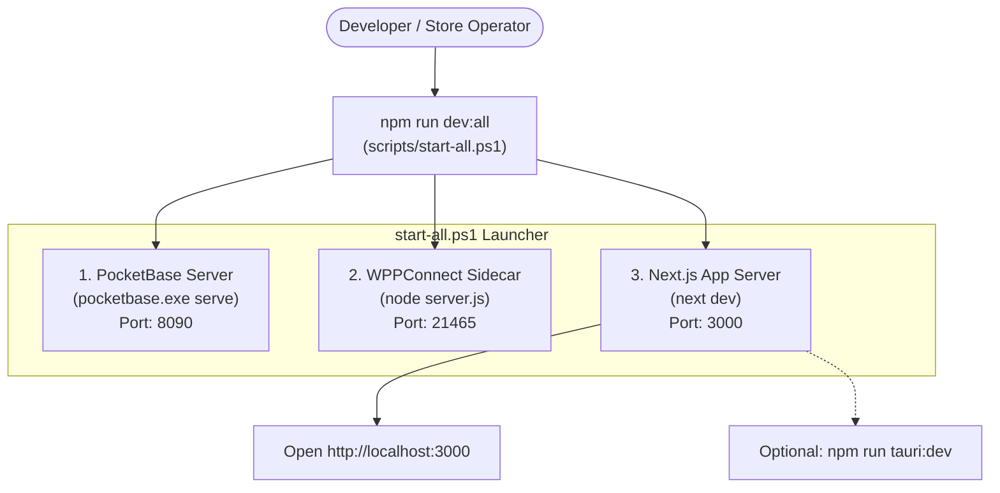
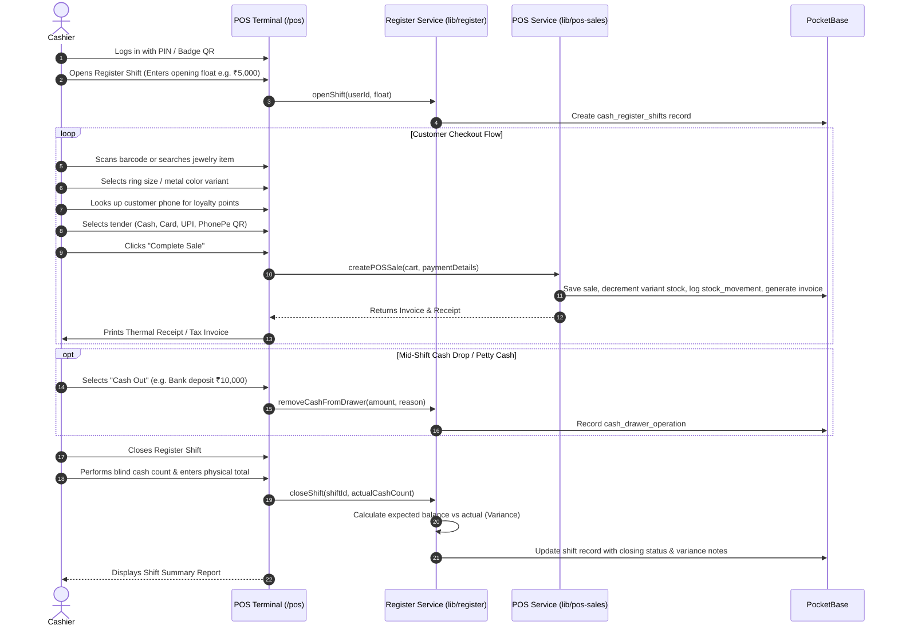
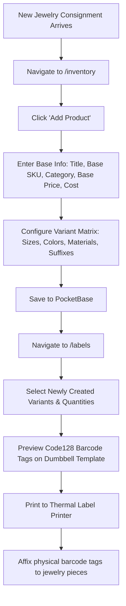
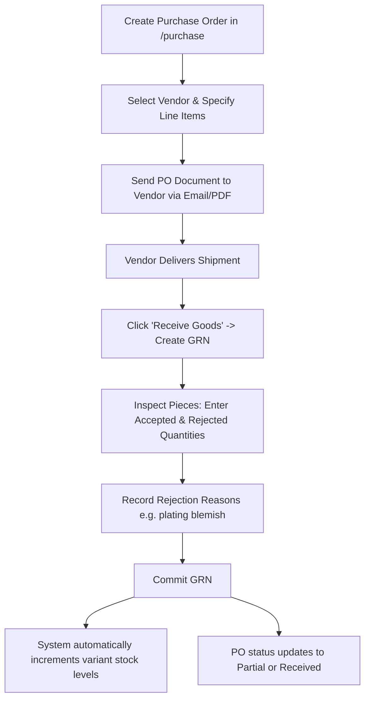

# Luminila Inventory Management — Operational Working & Workflows Guide

This document describes how the Luminila application operates, including service orchestration, startup procedures, step-by-step business workflows, and routine system maintenance.

---

## 1. System Startup & Service Orchestration

Luminila is designed to run locally with three coordinated background services. A single unified startup script manages their lifecycles.



### Starting the Application

#### Option A: Unified Launcher (Recommended)
Run the PowerShell launcher which boots PocketBase, the WhatsApp sidecar, and Next.js concurrently:

```powershell
npm run dev:all
```
*(Pressing `Ctrl+C` cleanly shuts down all background services.)*

#### Option B: Standalone Startup (Component by Component)
If running services in dedicated terminal windows:

1. **Terminal 1 — PocketBase:**
   ```powershell
   ./pocketbase/pocketbase.exe serve --http="127.0.0.1:8090" --dir="pocketbase/pb_data"
   ```
   *PocketBase Admin UI:* `http://127.0.0.1:8090/_/`

2. **Terminal 2 — WhatsApp Sidecar:**
   ```powershell
   cd wppconnect-sidecar
   node server.js
   ```

3. **Terminal 3 — Next.js Application:**
   ```powershell
   npm run dev
   ```
   *Application URL:* `http://localhost:3000`

#### Option C: Native Desktop App (Tauri)
To launch the native Windows desktop client:
```powershell
npm run tauri:dev
```

---

## 2. Core Operational Workflows

### Workflow 1: Store Cashier Day-to-Day POS Lifecycle



---

### Workflow 2: Inventory Ingestion & Barcode Tagging



1. **Catalog Entry**: Add product details in `/inventory`.
2. **Variant Matrix**: Populate sizes (e.g., US 6, 7, 8) and metal tones (Rose Gold, 925 Silver, Yellow Gold).
3. **Barcode Label Queue**: In `/labels`, pick the variants to print.
4. **Physical Tagging**: The system prints Code128 barcodes formatted for standard jewelry butterfly/dumbbell tags.
5. **Stock Movement Verification**: Confirm initial stock movements are logged under `stock_movements`.

---

### Workflow 3: Procurement & Goods Received Notes (GRN)



1. **Issue PO**: Create a purchase order in `/purchase` specifying unit costs, ordered quantities, and expected delivery dates.
2. **Shipment Arrival**: When goods arrive, open the PO and click **Create GRN**.
3. **Quality Inspection**: Inspect jewelry pieces. If 50 ordered and 48 passed QA, record `accepted: 48` and `rejected: 2` with rejection reason (e.g., *"stone loose"*).
4. **Auto-Stock Update**: Committing the GRN increments stock levels for accepted items only.

---

### Workflow 4: Wholesale & B2B Sales Workflow

1. **Quotation / Estimate**:
   - Go to `/orders` and create an **Estimate**.
   - Input buyer details, GSTIN, itemized rates, and expiry date.
2. **Order Confirmation**:
   - When the client approves, click **Convert to Sales Order**.
3. **Dispatch under Delivery Challan**:
   - Go to `/challan` and generate a **Delivery Challan** (type: `stock_transfer` or `sale_dispatch`).
   - Enter transporter details and vehicle number. If consignment value exceeds ₹50,000, export the E-Way Bill JSON for the portal.
4. **Tax Invoicing**:
   - Convert the sales order into an official **GST Tax Invoice** in `/invoices`.
   - The invoice calculates CGST/SGST or IGST based on place of supply.
5. **Payment Collection**:
   - Record partial or full payment under `/invoices/detail` (Bank transfer / Cheque / RTGS).

---

### Workflow 5: Customer Returns & Credit Note Handling

1. **Initiate Return**:
   - In `/returns`, click **New Return** and search by original invoice number or sale record.
2. **Select Items & Reason**:
   - Select items being returned and choose return reason (`defective`, `size_exchange`, `wrong_item`, `customer_request`).
3. **Issue Credit Note**:
   - The system creates a legal GST Credit Note with automatic number sequence (`CN-XXXX`).
4. **Restock Decision**:
   - If the item is resaleable (e.g. size exchange), mark `stock_restored = true`. Inventory is immediately incremented.
   - If defective, item is flagged for repair/quarantine.
5. **Refund Settlement**:
   - Issue refund via cash, UPI, or credit to customer account.

---

### Workflow 6: WhatsApp Automation & Bot Pairing

1. **Start Sidecar**: Ensure `wppconnect-sidecar` is running.
2. **QR Pairing**:
   - Open `/whatsapp` in Luminila.
   - Scan the rendered QR code with the WhatsApp mobile app (**Linked Devices > Link a Device**).
3. **Automated Order Updates**:
   - Once linked, completed sales can auto-dispatch invoice links or tracking details directly to customer WhatsApp numbers.
4. **Message Parsing**:
   - Incoming inquiries matching jewelry keywords are flagged in the order queue for quick conversion.

---

### Workflow 7: Daily Banking & Expense Tracking

1. **End-of-Day Banking Transfer**:
   - In `/banking`, transfer physical register cash from `Cash Drawer` to `Bank Current Account`.
   - Record the bank deposit slip reference.
2. **Operational Expense Vouchers**:
   - In `/expenses`, log showroom expenses (e.g., packaging bags, showroom maintenance, cleaning).
   - Select expense category, amount, and attach payment receipt.
3. **Review Reports**:
   - Review `/reports` for daily gross margin, tax collected, and inventory turnover.

---

## 3. Database Administration & Maintenance

### PocketBase Administration
- **Web Admin Console**: Navigate to `http://127.0.0.1:8090/_/` in any browser.
- **Admin Credentials**: Configured during first-time setup (default: `admin@luminila.com`).
- **Collection Management**: Inspect raw SQLite tables, verify indexes, and download uploaded media attachments.

### Schema Synchronization
When updating schema fields, run the automated TypeScript migration script:
```powershell
npx tsx src/scripts/sync-pb-schema.ts
```

### Database Backup
The entire database and uploaded media reside in a single directory:
- **Database file**: `pocketbase/pb_data/data.db`
- **Media attachments**: `pocketbase/pb_data/storage/`

To make a complete snapshot backup:
```powershell
# Copy the pb_data directory to a backup location
Copy-Item -Recurse -Force pocketbase/pb_data "backups/pb_data_$(Get-Date -Format 'yyyyMMdd_HHmmss')"
```
*Note: PocketBase runs in SQLite WAL mode. For live zero-downtime backups, use the PocketBase Admin Console backup feature under **Settings > Backups**.*
