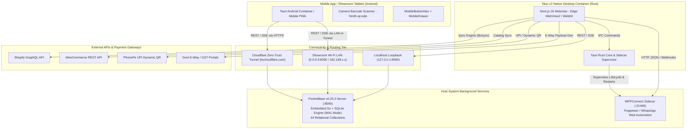
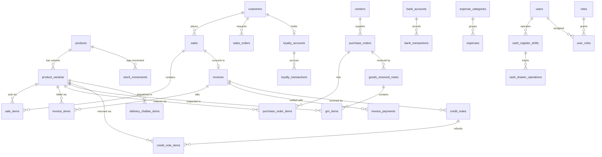
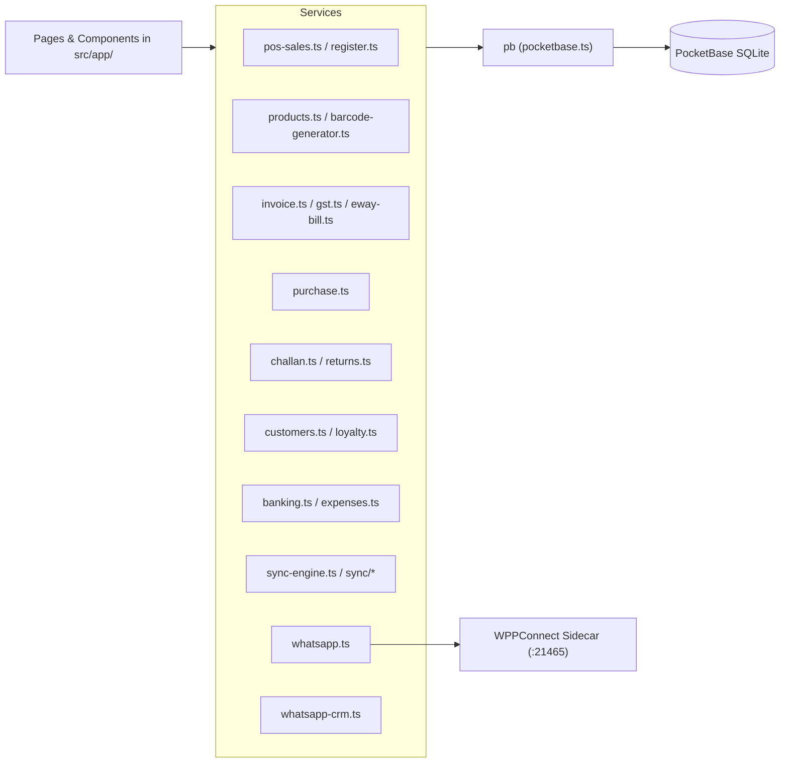
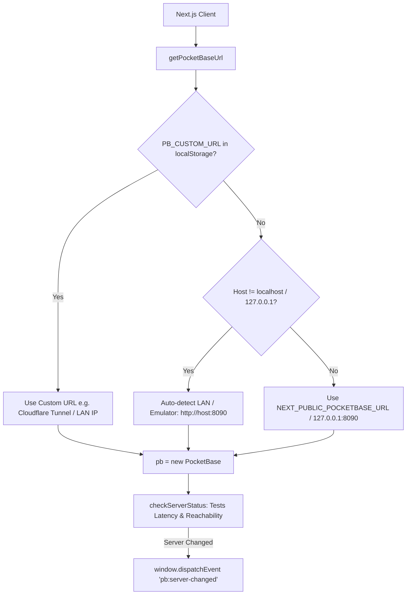

# Luminila Inventory Management — System Architecture

This document describes the end-to-end architecture, technology stack, data tier, service layering, mobile/responsive architecture, and deployment topology of the Luminila Inventory Management System. Any AI agent or engineer can use this document as a definitive reference for how the application is constructed and how its components interact.

---

## 1. System Overview & Topology

Luminila is architected as a hybrid desktop-first, local-network, and mobile-ready ERP solution designed specifically for fashion jewelry retail and wholesale businesses. It combines:
1. **Embedded Database Engine**: [PocketBase v0.25.0](https://pocketbase.io/) (Go server binary + SQLite in Write-Ahead Logging `WAL` mode; JS SDK `v0.26.x`).
2. **Native Shell Containers**: [Tauri v2.9.x](https://tauri.app/) (Rust) providing native desktop (Windows/macOS/Linux) and mobile (Android) runtimes.
3. **Modern Web Frontend**: [Next.js 16.1.0](https://nextjs.org/) (App Router) + React 19.2.3 with React Compiler and Tailwind CSS v4.
4. **Background Automation Sidecar**: Node.js [WPPConnect Server](https://github.com/wppconnect-team/wppconnect) automating WhatsApp Web via headless Puppeteer.
5. **Dynamic Network Gateway**: Flexible loopback (`127.0.0.1:8090`), LAN Wi-Fi (`192.168.x.x:8090`), or Cloudflare Zero-Trust Tunnel (`trycloudflare.com`) connection modes.



---

## 2. Technology Stack & Dependencies

| Layer | Technology | Version | Purpose |
|---|---|---|---|
| **Desktop & Mobile Shell** | [Tauri](https://tauri.app/) | `^2.9.1` (CLI `^2.9.6`) | Native Windows/macOS/Linux and Android container, process supervisor, IPC bridge |
| **Frontend Framework** | [Next.js](https://nextjs.org/) | `16.1.0` (App Router) | Static export (`output: 'export'`), routing, client layouts |
| **UI Runtime** | [React](https://react.dev/) | `19.2.3` | UI components, React Compiler (`babel-plugin-react-compiler`) |
| **UI Primitives** | `@base-ui/react`, Shadcn UI | `1.0.0`, `3.6.2` | Accessible, unstyled accessible UI primitives (dialogs, popovers, dropdowns) |
| **Styling & Design System** | [Tailwind CSS v4](https://tailwindcss.com/) | `^4.0.0` (`@tailwindcss/postcss`) | Bespoke jewelry theme (Midnight Navy, Moonstone Silver, Champagne Gold) |
| **Icons & Animations** | `lucide-react`, `tw-animate-css` | `^0.562.0`, `^1.4.0` | Vector icons and smooth micro-interactions |
| **Charts & Visualizations** | `recharts` | `^3.6.0` | Revenue trends, inventory valuation, and expense charts |
| **Barcodes & Camera** | `jsbarcode`, `html5-qrcode` | `^3.12.1`, `^2.3.8` | Code128 barcode generation, physical label printing, device camera scanning |
| **Spreadsheets & Data** | `exceljs`, `jszip` | `^4.4.0`, `^3.10.1` | Bulk catalog import/export and XLSX report generation |
| **Embedded Database & Auth** | [PocketBase](https://pocketbase.io/) | Server `v0.25.0` (Go SQLite), Client `^0.26.5` (JS SDK) | Embedded relational database, JWT auth, file storage, real-time SSE |
| **Messaging Sidecar** | [WPPConnect Server](https://github.com/wppconnect-team/wppconnect) | `^2.3.3` | WhatsApp Web automation, QR pairing, automated outbound order updates |
| **Language & Tooling** | TypeScript, Rust, Node.js | `TS 5`, `Rust 2021`, `Node 20+` | Type safety across entire stack and native binary performance |

---

## 3. Directory Structure & File Responsibilities

```
luminila_inv_mgmt/
├── src/
│   ├── app/                      # Next.js App Router (All Pages & Views)
│   │   ├── layout.tsx            # Root HTML layout, font setup, viewport meta, Sidebar & MobileBottomNav
│   │   ├── globals.css           # Tailwind CSS v4 design tokens and theme variables
│   │   ├── page.tsx              # Executive KPI dashboard (revenue, low stock, sales charts)
│   │   ├── activity/             # Audit logs and entity mutation timeline
│   │   ├── banking/              # Bank accounts, deposits, withdrawals, transfers
│   │   ├── challan/              # Delivery challan creation & dispatch tracking
│   │   ├── customers/            # Customer CRM, sales ledgers, loyalty profiles
│   │   ├── expenses/             # Expense vouchers and categorization
│   │   ├── inventory/            # Product catalog, variant matrix, stock levels
│   │   ├── invoices/             # GST B2B/B2C invoices, PDF rendering & thermal printing
│   │   ├── labels/               # Barcode label batch designer & printing (Code128)
│   │   ├── login/                # PocketBase JWT authentication & role redirection
│   │   ├── orders/               # Sales orders & quotation estimates
│   │   ├── pos/                  # Point of Sale touch terminal, cart, & shift management
│   │   ├── purchase/             # Purchase orders & Goods Received Notes (GRN)
│   │   ├── reports/              # Financial, tax, and inventory analytics reports
│   │   ├── returns/              # Customer returns & GST credit notes
│   │   ├── settings/             # Store configuration, tax rates, e-commerce sync
│   │   ├── setup/                # First-run admin initialization wizard
│   │   ├── users/                # Staff accounts and RBAC role assignment
│   │   ├── vendors/              # Supplier management & purchase histories
│   │   └── whatsapp/             # WPPConnect status, chat sync, auto-replies
│   ├── components/
│   │   ├── auth/                 # Authentication & authorization:
│   │   │   └── ProtectedRoute.tsx# RBAC route protection wrapper
│   │   ├── dashboard/            # KPI cards, revenue charts, alerts
│   │   ├── layout/               # Navigation components:
│   │   │   ├── Header.tsx        # Top desktop navigation & user session badge
│   │   │   ├── Sidebar.tsx       # Desktop collapsible sidebar
│   │   │   ├── MobileBottomNav.tsx # Mobile thumb-friendly navigation bar + elevated POS FAB
│   │   │   ├── MobileDrawer.tsx  # Mobile slide-over navigation with grouped ERP sub-domains
│   │   │   └── index.ts          # Layout components barrel export
│   │   ├── settings/             # Dynamic server configuration and Google Drive sync modals
│   │   ├── pos/                  # POS components:
│   │   │   └── POSWhatsAppWidget.tsx # Checkout WhatsApp messenger (receipt auto-send + payment links)
│   │   ├── whatsapp/             # Conversational CRM components:
│   │   │   ├── MessageActionMenu.tsx # Right-click / long-press context action engine (customer & vendor suites)
│   │   │   ├── VendorIngestionModal.tsx # Smart-extraction product ingestion & add-to-inventory
│   │   │   ├── WhatsAppDrawer.tsx    # Global floating slide-over chat drawer (mounted in root layout)
│   │   │   ├── BroadcastComposerModal.tsx # Anti-ban broadcast campaign composer (segmentation + merge tags)
│   │   │   ├── ChatContextMenu.tsx   # Legacy desktop message context menu
│   │   │   ├── SlashCommandPalette.tsx # Chat composer slash-command snippets
│   │   │   ├── RazorpayPaymentModal.tsx # In-chat payment link generator
│   │   │   └── WhatsAppCatalogSyncModal.tsx # WhatsApp Business catalog publisher
│   │   └── ui/                   # Reusable UI primitives (dialog, button, table, input, card)
│   ├── contexts/
│   │   └── AuthContext.tsx       # Auth state, current user, role verification
│   ├── hooks/
│   │   ├── use-viewport.ts       # Viewport detection (isMobile, isTablet, isDesktop, isTauri, isAndroid)
│   │   ├── use-long-press.ts     # 500ms long-press gesture with 10px tolerance & 40ms haptics
│   │   └── usePermissions.ts     # RBAC capability flags hook
│   ├── lib/                      # Domain Business Logic & API Services
│   │   ├── activity.ts           # Audit log persistence
│   │   ├── analytics.ts          # Aggregated dashboard metrics & charts
│   │   ├── banking.ts            # Banking ledger & double-entry balance updates
│   │   ├── barcode-generator.ts  # Code128 vector barcode generation
│   │   ├── challan.ts            # Delivery challan lifecycle management
│   │   ├── customers.ts          # Customer records & CRM history
│   │   ├── discounts.ts          # Coupon & promotion rule evaluation
│   │   ├── eway-bill.ts          # NIC E-Way Bill JSON generation
│   │   ├── expenses.ts           # Expense tracking & category accounting
│   │   ├── gst.ts                # GST calculations (CGST, SGST, IGST, reverse charge)
│   │   ├── invoice.ts            # Invoice numbering, PDF structure, payments
│   │   ├── loyalty.ts            # Tier calculation, point earning & redemption
│   │   ├── orders.ts             # Sales order state machine
│   │   ├── phonepe.ts            # UPI & dynamic QR payment integration
│   │   ├── pocketbase.ts         # PocketBase client singleton, URL switcher, health checks
│   │   ├── pos-sales.ts          # POS checkout, item deduction, cash records
│   │   ├── products.ts           # Catalog CRUD, variant matrix helpers
│   │   ├── purchase.ts           # PO creation, receiving, GRN generation
│   │   ├── rbac.ts               # Role permissions, system capability checks
│   │   ├── register.ts           # Cash drawer shifts, float operations, variance
│   │   ├── returns.ts            # Return requests, credit notes, restock logic
│   │   ├── sync/                 # Shopify & WooCommerce connector engines
│   │   ├── sync-engine.ts        # Unified synchronization scheduler
│   │   ├── whatsapp.ts           # WPPConnect sidecar REST client
│   │   ├── whatsapp-crm.ts       # Conversational CRM: contact resolution, chat persistence,
│   │                             #   staff attribution, intent detection, vendor offer parsing,
│   │                             #   product ingestion, label queue, POS cart broadcast,
│   │                             #   product cards, STOP opt-out registry
│   │   ├── payment-reconciliation.ts # Razorpay payment-link polling settlement engine
│   │   ├── whatsapp-broadcast.ts # Anti-ban staggered broadcast queue (jitter, quota, segments)
│   ├── scripts/                  # PocketBase migration, repair, and diagnostic scripts
│   │   ├── init-pocketbase.ts    # Creates all 38 core collections from scratch
│   │   ├── update-whatsapp-crm-schema.ts # Adds the 4 WhatsApp CRM collections
│   │   ├── sync-pb-schema.ts     # Synchronizes schema differences
│   │   ├── apply-pb-access-rules.ts # Sets collection security rules
│   │   ├── seed-roles.ts         # Populates system roles and capability flags
│   │   └── create-admin-user.ts  # Seeds default admin credentials
│   └── types/
│       └── database.ts           # TypeScript interfaces for all PocketBase collections
├── src-tauri/                    # Tauri v2 Desktop & Mobile Container
│   ├── Cargo.toml                # Rust dependencies (tauri, reqwest, tokio, tauri-plugin-shell)
│   ├── tauri.conf.json           # Window size, CSP, sidecar definitions, bundle config
│   ├── binaries/                 # Precompiled sidecars (wppconnect-server-<triple>.exe)
│   └── src/
│       ├── lib.rs                # Sidecar supervision, health monitoring loop, IPC commands
│       └── main.rs               # Rust executable entrypoint
├── pocketbase/                   # Embedded PocketBase Server
│   ├── pocketbase.exe            # PocketBase Go executable
│   └── pb_data/                  # SQLite database (data.db, auxiliary.db) + file storage
├── wppconnect-sidecar/           # Node.js Puppeteer sidecar for WhatsApp
│   ├── server.js                 # Express server on port 21465
│   ├── build.js                  # Compiles server.js via pkg into native sidecar binary
│   └── package.json              # Sidecar dependencies (@wppconnect-team/wppconnect)
├── scripts/                      # Operational automation scripts
│   ├── dev-all.js                # Cross-platform Node orchestrator (PB + WPP + Next.js)
│   └── start-all.ps1             # PowerShell multi-service launcher
├── next.config.ts                # Static export configuration for Tauri
└── package.json                  # Root project scripts and dependencies
```

---

## 4. Data Tier: 44 Relational Collections

PocketBase manages SQLite in `WAL` mode, providing ACID guarantees and high concurrent read performance. The schema is organized into 9 sub-domains — 38 core collections from `init-pocketbase.ts` plus 6 conversational-commerce collections from `update-whatsapp-crm-schema.ts`:



### Complete Collection Catalog

1. **Catalog & Stock**:
   - `products`: SKU, name, description, category, base_price, cost_price, image_url, barcode, is_active.
   - `product_variants`: SKU variant, size, color, material, stock_level, low_stock_threshold, price_adjustment.
   - `stock_movements`: Immutable stock ledger (`sale`, `purchase`, `adjustment`, `return`, `sync`) with quantity changes and reference IDs.

2. **Sales, Orders & Point of Sale (POS)**:
   - `sales`: Transaction header (channel: `pos`, `shopify`, `woocommerce`, `whatsapp`; totals, customer relation).
   - `sale_items`: Snapshot line items (unit price, quantity, total price, variant relation).
   - `sales_orders`: B2B customer sales orders and quotation estimates (order date, delivery date, totals, status: `draft` to `invoiced`/`cancelled`).
   - `sales_order_items`: Order line items with variant link, unit price, quantity, tax rate, item total.
   - `cash_register_shifts`: Cashier register sessions (opening float, cash additions/drops, expected vs actual closing balances, variance).
   - `cash_drawer_operations`: Individual cash drawer operations (`opening_float`, `add`, `remove`, `sale`, `refund`).

3. **Invoicing & GST Engine**:
   - `invoices`: Tax invoice headers conforming to Indian GST (B2B/B2C, seller/buyer GSTIN, place of supply, taxable value, CGST/SGST/IGST, reverse charge, vehicle details).
   - `invoice_items`: HSN code, tax rates, CGST/SGST/IGST amounts, discounts, line totals.
   - `invoice_payments`: Payment receipts against invoices (`cash`, `card`, `upi`, `bank_transfer`, `cheque`).
   - `number_sequences`: Document sequencing counter (`INV-`, `CN-`, `DC-`, `PO-`, `GRN-`).

4. **Procurement & Goods Receiving**:
   - `vendors`: Supplier directory (GSTIN, contact info, lead times, payment terms).
   - `purchase_orders`: Procurement POs with status workflow (`draft` → `sent` → `partial` → `received` → `cancelled`).
   - `purchase_order_items`: Quantities, unit costs, GST rates.
   - `goods_received_notes`: Warehouse arrival records (GRN) linked to POs.
   - `grn_items`: Inspected quantities, accepted quantities, rejected quantities, rejection reasons.

5. **Returns & Logistics**:
   - `credit_notes`: GST Credit Note records linked to invoices, tracking reason (`defective`, `wrong_item`, `damaged`, `size_exchange`, `customer_request`), refund status, and amount.
   - `credit_note_items`: Items returned, restock flags (`stock_restored`).
   - `delivery_challans`: Transport challans for job work, exhibitions, or inter-branch transfers.
   - `delivery_challan_items`: Dispatched goods with HSN codes, quantities, and approximate values.

6. **CRM & Loyalty Engine**:
   - `customers`: Customer profiles with contact details, GSTIN, aggregate spend.
   - `customer_interactions`: Logged customer touchpoints (calls, visits, queries).
   - `loyalty_settings`: System parameters (points per rupee, redemption value, min redemption points).
   - `loyalty_tiers`: Configurable tiers (Bronze, Silver, Gold, Platinum) with point multipliers.
   - `loyalty_accounts`: Customer point balances, lifetime values, member dates.
   - `loyalty_transactions`: Immutable point ledger (`earn`, `redeem`, `adjust`, `expire`, `bonus`).

7. **Treasury & Expenses**:
   - `bank_accounts`: Business accounts (Current, Cash-in-Hand, POS Drawer, Savings) with active balances.
   - `bank_transactions`: Double-entry transaction log (`deposit`, `withdrawal`, `transfer`).
   - `expense_categories`: Operational expense taxonomy (Rent, Packaging, Wages, Marketing).
   - `expenses`: Direct expense vouchers with payee, payment method, tax receipt attachments.

8. **Governance & System**:
   - `roles`: RBAC permissions dictionary with capability flags (`Admin`, `Manager`, `Staff`, `Cashier`, `Viewer`).
   - `user_roles`: Mapping between staff users and system roles.
   - `activity_logs`: Entity mutation history (storing previous and current JSON snapshots).
   - `discounts`: Promotional coupons and percentage/flat discounts.
   - `discount_usage`: Customer redemption records against coupons.
   - `store_settings`: Global store metadata, tax rates, API credentials.

9. **Conversational Commerce (WhatsApp CRM)** — created by `update-whatsapp-crm-schema.ts`:
   - `whatsapp_chats`: Conversation registry (`chat_id`, `contact_type: customer|vendor|lead`, customer/vendor relations, last message, unread count, status, assigned staff, labels).
   - `whatsapp_messages`: Persisted transcript (message id, from-me flag, sender, staff attribution, body, type, delivery status, timestamp).
   - `payment_links`: Razorpay/PhonePe payment link ledger (link id, short URL, amount, customer/order/invoice relations, `created|paid|partially_paid|expired|cancelled` status, payment id, paid timestamp).
   - `label_print_queue`: Barcode tag batch queue (variant, quantity, `dumbbell|butterfly|sheet` template, status, source).
   - `broadcast_messages`: Anti-ban campaign queue (campaign, customer relation, E.164 recipient, merge-tag rendered body, `queued|sent|failed|skipped` status, jittered `scheduled_at`).
   - `whatsapp_opt_outs`: STOP compliance registry (E.164 phone, customer relation, reason).

*(Note: The built-in PocketBase `users` authentication collection hosts system staff and administrator accounts, bringing the active schema to 43 relational tables).*

---

## 5. Service Layer Architecture (`src/lib/`)

All database interactions, calculations, and hardware calls are encapsulated in `src/lib/`:



### Domain Module Contracts
- **`pos-sales.ts`**: Atomically executes checkout transactions: validates stock, creates sale record, creates sale items, decrements variant quantities, writes stock movements, creates tax invoice, and updates shift cash balance.
- **`register.ts`**: Governs register shifts (`openShift`, `closeShift`), cash drawer additions/drops, and closing variance calculation.
- **`invoice.ts` & `gst.ts`**: Implements Indian GST tax rules: intra-state (CGST + SGST) vs inter-state (IGST), number-to-words currency formatting, and sequential invoice numbers.
- **`products.ts` & `barcode-generator.ts`**: Manages product CRUD, variant combinations (size/color/material), and renders Code128 barcode vector SVGs for jewelry labels.
- **`purchase.ts`**: Manages procurement PO states and Goods Received Note (GRN) quality control inspections.
- **`returns.ts`**: Issues legal GST credit notes, coordinates refunds, and handles inventory restock.
- **`loyalty.ts`**: Calculates tiered point accruals based on invoice subtotals and checks redemption limits.
- **`banking.ts` & `expenses.ts`**: Double-entry ledger updates for cash drawer drops, bank deposits, and expense vouchers.
- **`whatsapp.ts` & `mobile-whatsapp.ts`**: Communicates with the local WPPConnect sidecar over HTTP to fetch pairing QR codes and dispatch order updates, with fallback to native Android `whatsapp://` intent for 1-tap dispatch.
- **`whatsapp-crm.ts`**: Conversational CRM bridge — E.164 contact resolution (vendor → customer → auto-created lead), `whatsapp_chats`/`whatsapp_messages` persistence with unread tracking, staff-attribution outbound sends, inbound intent classification (`STOCK_INQUIRY`, `ORDER_STATUS`, `PRICE_CHECK`, `VENDOR_OFFER`, …), vendor-offer parsing with auto-SKU product ingestion (incl. draft GRN + stock movements), `label_print_queue` tag queueing, and the live POS cart broadcast bridge (`BroadcastChannel('pos_cart')` + `pos:cart-updated`).
- **`mobile-scanner.ts`**: Unified hardware USB/Bluetooth barcode scanner listener (keyboard wedge), Tauri native scanner, and HTML5 camera fallback.
- **`mobile-printer.ts`**: Android system print spooler integration and ESC/POS thermal receipt formatting for 58mm / 80mm wireless/Bluetooth POS receipt printers.
- **`offline-queue.ts`**: Offline transaction queue persisting mutations locally with automatic drain and replay upon network reconnection.
- **`google-drive-sync.ts`**: Decentralized Tier 2 cloud sync engine writing incremental JSON changelog mutations to Google Drive for multi-device synchronization without dedicated backend servers.
- **`sync/`**: Connector engines for Shopify GraphQL API and WooCommerce REST API.

---

## 6. Responsive & Mobile Architecture

To support retail showroom staff using Android tablets, phones, and touch POS terminals, the UI employs a responsive design strategy:

### 6.1 Viewport Detection (`src/hooks/use-viewport.ts`)
The `useViewport` hook detects the device form factor and environment:
- `isMobile`: Screen width `< 768px` (smartphones)
- `isTablet`: Screen width `768px - 1024px` (tablets/iPads)
- `isDesktop`: Screen width `> 1024px` (desktop monitors)
- `isTauri`: Detects if running inside the Tauri native container
- `isAndroid`: Detects Android user-agent or Tauri Android environment

### 6.2 Mobile Navigation Structure
- **Desktop (`md:flex`)**: Persistent collapsible `Sidebar.tsx` with all ERP sub-menus.
- **Mobile (`md:hidden`)**: 
  - `MobileBottomNav.tsx`: Fixed bottom bar with quick links (Home, Stock, Invoices, Menu) and an elevated Center Floating Action Button (FAB) dedicated to Point of Sale (`/pos`).
  - `MobileDrawer.tsx`: Slide-over drawer organizing all 17 ERP modules into clear functional sections (Sales & POS, Inventory & Catalog, Finance & Accounts, Showroom & System).

### 6.3 Camera Barcode Scanning
On mobile devices without physical USB barcode guns, `html5-qrcode` utilizes the device's native rear camera to scan Code128 product tags directly into the POS cart.

### 6.4 Standalone PWA Architecture (`public/manifest.json`)
To enable full-screen dedicated windowing on Android tablets and smartphones without browser chrome:
- **Web App Manifest**: Configured with `"display": "standalone"`, `"orientation": "any"`, and theme colors matching Luminila’s midnight navy design system (`#001F3F`).
- **Apple & Mobile Meta**: `layout.tsx` exposes `appleWebApp: { capable: true, statusBarStyle: "black-translucent" }` and viewport cover parameters.
- **Hardware Capability Parity**: The PWA mode maintains 100% feature parity with native Android builds, accessing camera barcode scanning via WebRTC `getUserMedia`, printing via the Android Print Spooler, and queueing offline mutations in IndexedDB.

### 6.5 Filesystem Constraints & Native APK Compilation
- **exFAT Filesystem Limitation**: When developing on an external drive formatted as `exFAT`, Windows forbids the creation of symbolic links at the OS kernel level (`Incorrect function. (os error 1)`). This causes Tauri’s automated Android CLI to abort when linking `libapp_lib.so` to the Android Gradle `jniLibs` directory.
- **Distribution Strategy**:
  1. *Showroom Deployment*: Install directly as a standalone Progressive Web App via Chrome on showroom tablets/phones.
  2. *Release APK Compilation*: Compile the native binary on an NTFS partition (e.g. `C:\`), where Windows symbolic links and cross-drive Gradle builds are natively supported.

### 6.6 Global Conversational Surfaces (WhatsApp CRM)
WhatsApp messaging is embedded across three coordinated surfaces so staff never navigate away from active tasks:
1. **Full-Screen Hub (`/whatsapp`)**: High-volume 3-pane CRM workspace with contact-type badges (`Customer`/`Vendor`/`Lead`), the context action engine (right-click on desktop, 500 ms long-press bottom sheet with 40 ms haptics on mobile), and the vendor ingestion modals.
2. **Global Slide-Over Drawer (`WhatsAppDrawer.tsx`)**: Unread-badged floating button pinned to every route, mounted once in the root layout (`src/app/layout.tsx`); opens the conversation list and composer without page reloads.
3. **POS Checkout Widget (`POSWhatsAppWidget.tsx`)**: Embedded in the POS terminal — WhatsApp verification indicator, pre-checked auto-receipt dispatch on checkout, and 1-tap Razorpay payment links recorded in the `payment_links` ledger.

---

## 7. Dynamic Server URL & Network Architecture (`src/lib/pocketbase.ts`)

Because PocketBase is an embedded local backend, mobile devices and external clients need flexible connectivity:



- **`getPocketBaseUrl()`**: Checks `localStorage.getItem("PB_CUSTOM_URL")` first. If absent and the client is running on an external host or Android emulator (hostname is not `localhost` or `127.0.0.1`), it automatically defaults to `http://<window.location.hostname>:8090`. Otherwise, it falls back to `process.env.NEXT_PUBLIC_POCKETBASE_URL` or `http://127.0.0.1:8090`.
- **`setPocketBaseUrl(url)`**: Dynamically repoints the PocketBase client at runtime, persists to `localStorage`, and fires a `pb:server-changed` window event so UI views refresh without page reloads.
- **`checkServerStatus(targetUrl)`**: Asynchronously tests server reachability, measures round-trip latency in milliseconds, and detects if the connection is running over a tunnel.

---

## 8. Desktop Shell Architecture (Tauri v2)

Tauri v2 compiles into a native Windows, macOS, or Linux application with a tiny footprint (<30 MB) by utilizing native OS WebViews (Edge WebView2 on Windows).

### 8.1 Rust Supervisor & Sidecar Lifecycle (`src-tauri/src/lib.rs`)
The Rust backend is responsible for:
1. **Sidecar Process Execution**: Spawns the compiled `wppconnect-server` binary on application launch. *(Note: PocketBase runs as an independent host daemon managed by `scripts/dev-all.js` or an OS background service).*
2. **Background Health Monitoring Loop**: Polls `http://127.0.0.1:21465/health` every 5 seconds. If the sidecar terminates or fails 3 consecutive health checks, the Rust supervisor automatically kills the dead PID and respawns a fresh sidecar process.
3. **Tauri IPC Commands**: Exposes `get_sidecar_status` and `restart_sidecar` to the Next.js frontend.
4. **Content Security Policy (CSP)**: Locks down origin permissions to local loopback ports and verified external endpoints (`connect-src 'self' http: https: ws: wss:`).

---

## 9. Security, Authentication & RBAC

### 9.1 Authentication Architecture
- **JWT Identity**: Users authenticate against PocketBase's native `users` auth collection via email and password (`pb.collection('users').authWithPassword`). PocketBase issues a cryptographically signed JWT stored in `pb.authStore`.
- **State Hydration**: `AuthContext.tsx` synchronizes with `pb.authStore`, persisting sessions across page reloads.
- **Cashier Quick Switch (Roadmap)**: Dedicated PIN/badge quick-switching is slated for Milestone 3. Currently, session switching uses standard credential re-authentication.

### 9.2 Role-Based Access Control (RBAC)
The application defines five standard roles in `src/scripts/seed-roles.ts` (`Admin`, `Manager`, `Staff`, `Cashier`, `Viewer`), each carrying granular permission matrices:

```json
{
  "Admin": { "all_modules": ["create", "read", "update", "delete", "print", "export"] },
  "Manager": { "operations": ["create", "read", "update", "print", "export"] },
  "Staff": { "daily_ops": ["create", "read", "update", "print"] },
  "Cashier": { "pos_sales": ["create", "read", "print"], "drawer": ["read", "update"] },
  "Viewer": { "read_only": ["read"] }
}
```

The `ProtectedRoute` component and `usePermissions` hook intercept unauthorized route navigation and disable forbidden UI actions based on assigned user roles.

The `ProtectedRoute` component and `usePermission` hook intercept unauthorized route navigation and disable forbidden UI actions.
