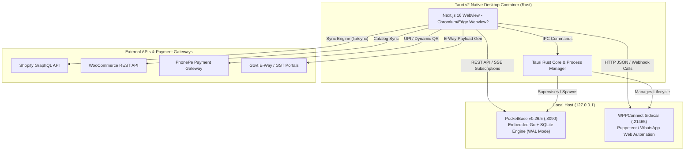
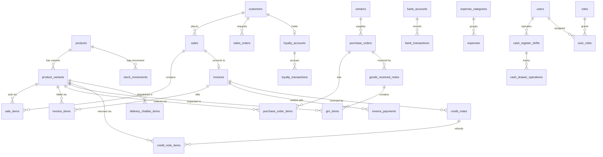
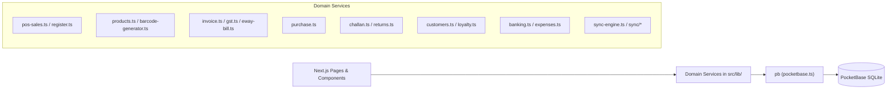

# Luminila Inventory Management — System Architecture

This document describes the end-to-end architecture, technology stack, data tier, service layering, and deployment topology of the Luminila Inventory Management System.

---

## 1. System Overview & Topology

Luminila is designed as a hybrid desktop-first and local-network ERP/inventory solution tailored for fashion jewelry businesses. It combines an embedded Go/SQLite database engine (**PocketBase**), a desktop container (**Tauri v2**), a modern frontend application (**Next.js 16 + React 19**), and background automation microservices (such as **WPPConnect**).



---

## 2. Technology Stack

| Layer | Technology | Purpose |
|---|---|---|
| **Desktop Shell** | [Tauri v2.9.x](https://tauri.app/) (Rust) | Native lightweight window container, sidecar supervision, native OS access |
| **Frontend Framework** | [Next.js 16.1.0](https://nextjs.org/) (App Router) | Client-side routing, React 19 compiler, modern page layouts |
| **UI Library & Primitives** | React 19.2.3, `@base-ui/react`, Shadcn UI primitives | Accessible components, modals, popovers, dropdowns |
| **Styling** | [Tailwind CSS v4](https://tailwindcss.com/) | Bespoke jewelry brand design system (Midnight Navy, Moonstone Silver, Champagne Gold) |
| **Icons & Visuals** | `lucide-react`, `tw-animate-css` | Micro-animations, visual cues, status indicators |
| **Charts & Analytics** | `recharts` | Real-time sales, inventory valuation, and expense charts |
| **Barcodes & Labels** | `jsbarcode`, `html5-qrcode` | Code128 barcode generation, physical label printing, camera barcode scanning |
| **Spreadsheets & Data** | `exceljs`, `jszip` | Bulk catalog import/export, Excel generation |
| **Database & Auth** | [PocketBase v0.26.5](https://pocketbase.io/) (SQLite) | Embedded relational database, JWT authentication, file storage, real-time SSE |
| **Messaging Sidecar** | [WPPConnect Server](https://github.com/wppconnect-team/wppconnect) | WhatsApp Web automation, QR authentication, order notification auto-dispatch |

---

## 3. Directory Structure & Layering

```
luminila_inv_mgmt/
├── src/
│   ├── app/                      # Next.js App Router (Pages & Views)
│   │   ├── activity/             # System audit & activity timeline
│   │   ├── banking/              # Bank accounts, deposits, withdrawals, transfers
│   │   ├── challan/              # Delivery challan creation & tracking
│   │   ├── customers/            # Customer CRM, ledgers, loyalty profiles
│   │   ├── expenses/             # Expense vouchers & categorized expenses
│   │   ├── inventory/            # Product catalog, variant matrix, stock levels
│   │   ├── invoices/             # GST invoices, B2B/B2C, PDF rendering
│   │   ├── labels/               # Barcode label batch designer & printing
│   │   ├── login/                # PocketBase JWT authentication, PIN & QR login
│   │   ├── orders/               # Sales orders & quotation estimates
│   │   ├── page.tsx              # Executive KPI dashboard
│   │   ├── pos/                  # Point of Sale terminal & shift management
│   │   ├── purchase/             # Purchase orders & Goods Received Notes (GRN)
│   │   ├── reports/              # Financial, tax, and inventory analytics
│   │   ├── returns/              # Returns & GST credit notes
│   │   ├── settings/             # Store configuration, tax rates, integrations
│   │   ├── setup/                # First-run admin initialization wizard
│   │   ├── users/                # Staff user accounts & RBAC assignment
│   │   ├── vendors/              # Supplier management & purchase histories
│   │   └── whatsapp/             # WPPConnect status, chat sync, auto-replies
│   ├── components/
│   │   ├── dashboard/            # KPI cards, charts, alerts
│   │   ├── layout/               # Header, Sidebar, ProtectedRoute, ShiftStatus
│   │   └── ui/                   # Reusable UI primitives (dialog, button, table, input)
│   ├── contexts/
│   │   └── AuthContext.tsx       # Auth state, current user, role permissions
│   ├── hooks/
│   │   └── use-mobile.ts         # Viewport and device detection
│   ├── lib/                      # Domain Business Logic & API Services
│   │   ├── activity.ts           # Audit log persistence
│   │   ├── analytics.ts          # Aggregated dashboard metrics & charts
│   │   ├── banking.ts            # Banking ledger & double-entry updates
│   │   ├── barcode-generator.ts  # Code128 vector barcode generation
│   │   ├── challan.ts            # Delivery challan lifecycle management
│   │   ├── customers.ts          # Customer records & CRM history
│   │   ├── discounts.ts          # Coupon & promotion rule evaluation
│   │   ├── eway-bill.ts          # NIC E-Way Bill JSON generation
│   │   ├── expenses.ts           # Expense tracking & category accounting
│   │   ├── gst.ts                # GST calculations (CGST, SGST, IGST, reverse charge)
│   │   ├── invoice.ts            # Invoice numbering, PDF structure, payments
│   │   ├── loyalty.ts            # Tier calculation, point earning & redemption
│   │   ├── orders.ts             # Sales order state machine
│   │   ├── phonepe.ts            # UPI & dynamic QR payment integration
│   │   ├── pocketbase.ts         # PocketBase client singleton & sanitization
│   │   ├── pos-sales.ts          # POS checkout, item deduction, cash records
│   │   ├── products.ts           # Catalog CRUD, variant matrix helpers
│   │   ├── purchase.ts           # PO creation, receiving, GRN generation
│   │   ├── rbac.ts               # Role permissions, system capability checks
│   │   ├── register.ts           # Cash drawer shifts, float operations, variance
│   │   ├── returns.ts            # Return requests, credit notes, restock logic
│   │   ├── sync/                 # Shopify & WooCommerce connector engines
│   │   ├── sync-engine.ts        # Unified synchronization scheduler
│   │   └── whatsapp.ts           # WPPConnect sidecar REST client
│   └── types/
│       └── database.ts           # TypeScript interfaces for all 38 collections
├── src-tauri/                    # Tauri v2 Desktop Wrapper
│   ├── tauri.conf.json           # Window size, CSP, sidecar definitions
│   └── src/                      # Rust main process & event handlers
├── pocketbase/                   # Embedded PocketBase Server
│   ├── pocketbase.exe            # PocketBase Go binary
│   ├── pb_data/                  # SQLite database (data.db) + uploaded media
│   └── pb_migrations/            # Declarative schema migrations
├── wppconnect-sidecar/           # Node.js Puppeteer sidecar for WhatsApp
├── scripts/                      # Startup & operational automation scripts
│   └── start-all.ps1             # Multi-service launcher (PocketBase + WPP + Next.js)
└── package.json
```

---

## 4. Data Tier: PocketBase Schema Design

The persistence tier runs entirely inside PocketBase, backed by SQLite in Write-Ahead Logging (`WAL`) mode for high concurrency.

The schema comprises **38 relational collections** grouped into 8 operational sub-domains:



### Schema Sub-Domains

1. **Catalog & Inventory**
   - `products`: Base catalog records (SKU, title, category, base price, cost price, image URL, barcode).
   - `product_variants`: SKU variants (size, color, material, price adjustment, current `stock_level`, `low_stock_threshold`).
   - `stock_movements`: Immutable inventory audit log tracking every movement (`sale`, `purchase`, `adjustment`, `return`, `sync`) with before/after quantity stamps.

2. **Sales & Point of Sale (POS)**
   - `sales`: Transaction header (channel: POS, Shopify, WooCommerce, WhatsApp; totals, payment method, customer relation).
   - `sale_items`: Snapshot line items (unit price, quantity, totals, variant relation).
   - `cash_register_shifts`: Cashier register sessions (terminal ID, opened/closed timestamps, opening balance float, cash additions/drops, expected vs actual closing balances, variance).
   - `cash_drawer_operations`: Line-by-line cash drawer events (`add`, `remove`, `sale`, `refund`).

3. **Invoicing & GST Engine**
   - `invoices`: Tax invoice headers conforming to Indian GST mandates (seller & buyer GSTIN, place of supply, taxable value, CGST/SGST/IGST breakdown, reverse charge, transport mode, vehicle number).
   - `invoice_items`: HSN code, tax rates, CGST/SGST/IGST calculated amounts, discount rates, line totals.
   - `invoice_payments`: Partial or full payment receipts against invoices (`cash`, `card`, `upi`, `bank_transfer`, `cheque`).
   - `number_sequences`: Concurrency-safe auto-incrementing document sequence generator for `INV-`, `CN-`, `DC-`, `PO-`, `GRN-`.

4. **Procurement & Goods Receiving**
   - `vendors`: Supplier directory (GSTIN, contact details, payment terms).
   - `purchase_orders`: Formal procurement POs with expected delivery dates and status workflow (`draft` → `sent` → `partial` → `received` → `cancelled`).
   - `purchase_order_items`: Ordered quantities, unit costs, GST rates.
   - `goods_received_notes`: Warehouse arrival records (GRN) linked to POs.
   - `grn_items`: Inspected quantities, accepted quantities, rejected quantities, rejection reasons.

5. **Returns & Logistics**
   - `credit_notes`: GST Credit Note records linked to original invoices, tracking reason (`defective`, `wrong_item`, `damaged`, `size_exchange`, `customer_request`), refund status, and amount.
   - `credit_note_items`: Items being returned, restock flags (`stock_restored`).
   - `delivery_challans`: Transport challans for job work, exhibition, inter-branch stock transfer, or approval delivery.
   - `delivery_challan_items`: Dispatched goods with HSN codes, quantities, and approximate values.

6. **CRM & Loyalty Engine**
   - `customers`: Customer profiles with GSTIN, contact details, aggregate spend.
   - `customer_interactions`: Logged customer touchpoints (calls, visits, queries).
   - `loyalty_settings`: System-wide parameters (points per rupee, redemption value, min redemption points).
   - `loyalty_tiers`: Configurable tiers (Bronze, Silver, Gold, Platinum) with point thresholds and percentage multipliers.
   - `loyalty_accounts`: Customer point balances, lifetime values, member dates.
   - `loyalty_transactions`: Immutable point accrual and redemption audit trail (`earn`, `redeem`, `adjust`, `expire`, `bonus`).

7. **Treasury & Expenses**
   - `bank_accounts`: Business accounts (current account, cash-in-hand, POS drawer, savings) with active balances.
   - `bank_transactions`: Double-entry transaction log (`deposit`, `withdrawal`, `transfer`).
   - `expense_categories`: Operational expense taxonomy (Rent, Utilities, Packaging, Wages, Marketing).
   - `expenses`: Direct expense vouchers with payee, payment method, tax receipt attachments.

8. **Governance & Multi-Channel Sync**
   - `roles` & `user_roles`: RBAC permissions dictionary and user assignments.
   - `activity_logs`: Entity mutation history (storing previous and current JSON snapshots).
   - `discounts` & `discount_usage`: Coupon codes, percentage/flat discounts, usage caps.
   - `store_settings`: Key-value configuration for store details, GST rates, API credentials.

---

## 5. Service Layer Design (`src/lib/`)

The application avoids scattered direct database calls in UI components by encapsulating operations into domain-driven service modules:



### Key Service Module Roles
- **`pos-sales.ts`**: Coordinates atomic checkout transactions: records sale, creates sale items, decrements variant inventory, writes stock movement entries, creates invoice records, and updates shift cash totals.
- **`register.ts`**: Governs cashier shifts, drawer operations, and reconciliation calculations.
- **`invoice.ts` & `gst.ts`**: Evaluates intra-state vs inter-state tax liability (CGST + SGST vs IGST), formats numbers into Indian currency words, and issues sequential invoice numbers.
- **`purchase.ts`**: Handles purchase order states, partial receipt tracking, and warehouse GRN generation.
- **`returns.ts`**: Manages customer return requests, calculates credit note adjustments, and restocks inventory.
- **`loyalty.ts`**: Computes point accruals based on invoice subtotals, checks tier advancement thresholds, and applies point redemption limits.
- **`whatsapp.ts`**: Interacts with the local WPPConnect sidecar server over HTTP, handling QR retrieval, authentication status, and automated outbound notifications.

---

## 6. Security & Authentication Architecture

### Authentication Model
1. **PocketBase Identity**: Users authenticate against PocketBase's native auth system via email/password. PocketBase generates a signed JWT stored locally in `pb.authStore`.
2. **Session Persistence**: `pb.authStore` persists in `localStorage` across page reloads. An `AuthContext` provides user data and reactive auth state.
3. **Quick Switch (PIN / QR)**: Cashiers at retail terminals can quickly unlock or switch terminal sessions using a 4-to-6 digit PIN or an authenticated badge QR code without retyping lengthy passwords.

### Role-Based Access Control (RBAC)
User permissions are decoupled into roles (`admin`, `manager`, `cashier`, `inventory_clerk`). Each role defines explicit capability flags stored in a JSON structure:

```json
{
  "pos": { "create_sale": true, "apply_discount": true, "override_price": false },
  "inventory": { "view": true, "edit_stock": false, "create_product": false },
  "invoices": { "view": true, "cancel": false },
  "reports": { "view_financials": false }
}
```

The `usePermission` hook and `ProtectedRoute` component verify capability claims before rendering routes or permitting mutating actions.

---

## 7. Desktop Integration (Tauri v2)

For desktop retail installations, Tauri v2 wraps the Next.js frontend into a lightweight native binary:
- **Zero Heavy Runtimes**: Unlike Electron, Tauri uses the native OS Webview (Webview2 on Windows, WebKit on macOS/Linux), keeping the installation footprint below 30 MB.
- **Process Supervision**: Tauri starts and monitors the WPPConnect sidecar process via `externalBin` configurations.
- **Content Security Policy (CSP)**: `tauri.conf.json` defines strict origins, permitting connections solely to local loopback ports (`127.0.0.1:8090`, `127.0.0.1:21465`) and verified payment or sync endpoints.
