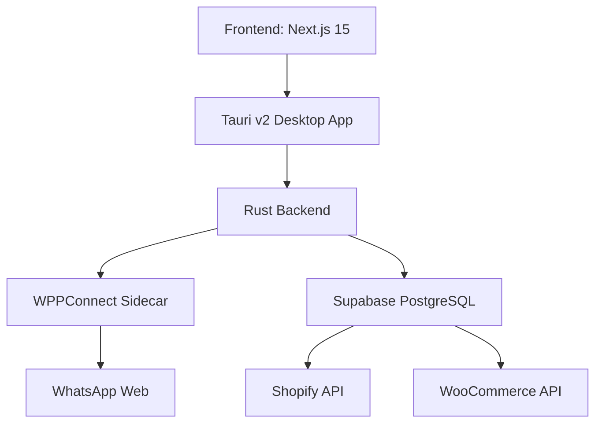
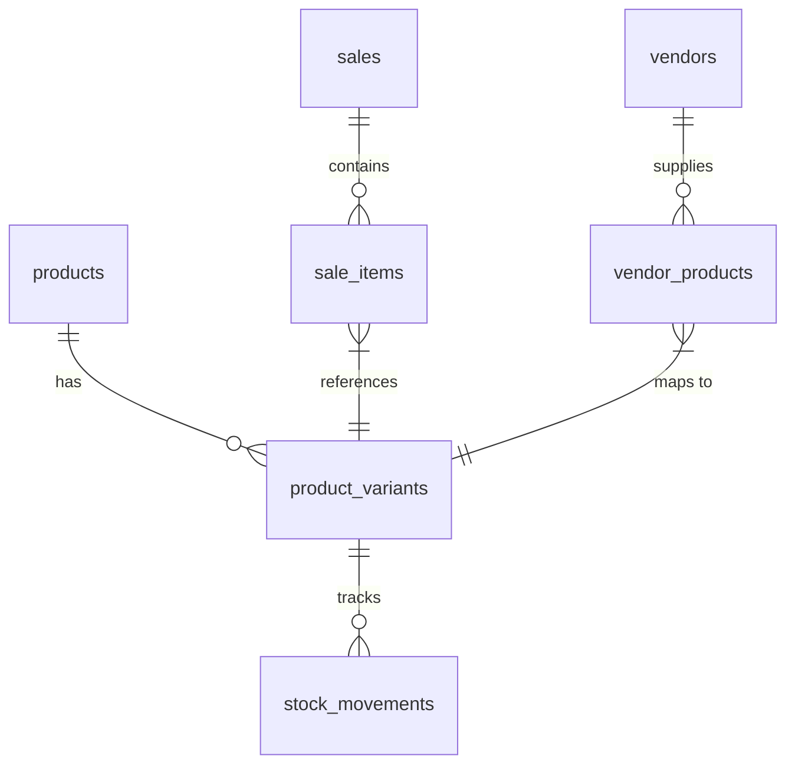

# Luminila Inventory Management System - Technical Report

## Executive Summary

Luminila is a premium inventory management system designed specifically for fashion jewelry brands. It provides a comprehensive solution for managing multi-channel sales, inventory tracking, and customer interactions through an integrated platform.

## System Architecture

### High-Level Architecture



### Technology Stack

- **Frontend**: Next.js 15 with React 19, TypeScript 5
- **Desktop Framework**: Tauri v2 with Rust backend
- **Database**: Supabase PostgreSQL with realtime capabilities
- **Styling**: Tailwind CSS with custom Luminila theme
- **State Management**: React hooks and context API
- **Build Tools**: Vite, SWC compiler
- **Package Management**: npm

### Key Architectural Decisions

1. **Tauri over Electron**: Chosen for smaller binary size, better performance, and native integration
2. **Supabase over Firebase**: Provides PostgreSQL flexibility with realtime capabilities
3. **Modular Component Design**: Separation of concerns with clear boundaries between UI, business logic, and data access
4. **Offline-First Approach**: Local state management with sync capabilities

## Core Components

### 1. Desktop Application (Tauri)

- **Main Process**: Rust-based application lifecycle management
- **Sidecar Management**: WPPConnect server for WhatsApp integration
- **Inter-Process Communication**: Tauri commands for frontend-backend communication
- **Health Monitoring**: Automatic restart of failed sidecar processes

### 2. Web Frontend (Next.js)

- **App Router**: File-based routing system
- **UI Components**: ShadCN component library with custom styling
- **State Management**: React hooks and context API
- **Theming**: Custom Luminila theme with Midnight Navy, Moonstone Silver, and Champagne Gold colors

### 3. Database Layer (Supabase)

- **Schema Design**: Comprehensive relational model for products, variants, sales, and inventory
- **Realtime Updates**: PostgreSQL triggers and Supabase realtime API
- **Row-Level Security**: Fine-grained access control policies
- **Data Validation**: TypeScript types generated from database schema

### 4. Integration Services

- **Shopify Sync Engine**: GraphQL API integration for product and order synchronization
- **WooCommerce Sync**: REST API integration for fallback e-commerce platform
- **WhatsApp Automation**: WPPConnect sidecar for message parsing and auto-reply
- **Barcode Generation**: jsbarcode library for label printing

## Database Schema

### Core Tables

1. **products**: Base product information with SKU, pricing, and metadata
2. **product_variants**: Size, color, and material variants with stock tracking
3. **vendors**: Supplier information and contact details
4. **sales**: Transaction records across all channels
5. **sale_items**: Line items for each sale
6. **stock_movements**: Comprehensive audit trail of inventory changes

### Key Relationships



## Key Features

### 1. Multi-Channel Inventory Management

- **Point of Sale (PoS)**: Touch-friendly interface with barcode scanning
- **Shopify Integration**: Real-time inventory sync via GraphQL API
- **WooCommerce Support**: Optional fallback e-commerce integration
- **WhatsApp Orders**: AI-powered message parsing and order detection

### 2. Advanced Inventory Features

- **Multi-Variant Products**: Support for size, color, and material variations
- **Low Stock Alerts**: Configurable thresholds with visual indicators
- **Batch Operations**: Bulk import/export via CSV
- **Barcode System**: Code128 barcode generation for labels

### 3. Sales and Order Management

- **Unified Order Tracking**: Consolidated view across all sales channels
- **Order Status Workflow**: Pending → Confirmed → Shipped → Delivered → Cancelled
- **Customer Management**: Contact information and order history
- **Revenue Analytics**: Sales reporting and performance metrics

### 4. WhatsApp Integration

- **Message Parsing**: AI detection of order intent and product mentions
- **Auto-Reply System**: Context-aware responses for common inquiries
- **Order Confirmation**: Automated shipping updates via WhatsApp
- **Media Handling**: Image, video, and document support

### 5. Sync Engine

- **Bidirectional Synchronization**: Push and pull operations for all channels
- **Conflict Resolution**: Timestamp-based conflict handling
- **Status Tracking**: Comprehensive sync history and error logging
- **Offline Support**: Queue operations for later synchronization

## Technical Implementation Details

### 1. Tauri Backend (Rust)

```rust
// src-tauri/src/lib.rs
pub fn run() {
    tauri::Builder::default()
        .plugin(tauri_plugin_shell::init())
        .setup(|app| {
            // Initialize logging
            // Start WPPConnect sidecar
            // Set up health monitoring
            Ok(())
        })
        .invoke_handler(tauri::generate_handler![
            get_sidecar_status,
            restart_sidecar
        ])
        .run(tauri::generate_context!())
        .expect("error while running tauri application");
}
```

### 2. Supabase Integration

```typescript
// src/lib/supabase.ts
export function getSupabase(): SupabaseClient<Database> {
    if (!supabaseClient) {
        supabaseClient = createClient<Database>(supabaseUrl, supabaseAnonKey, {
            auth: { persistSession: true, autoRefreshToken: true },
            realtime: { params: { eventsPerSecond: 10 } }
        });
    }
    return supabaseClient;
}
```

### 3. Sync Engine

```typescript
// src/lib/sync-engine.ts
export async function fullSync(onProgress?: (phase: string, progress: number) => void): Promise<SyncResult[]> {
    const allResults: SyncResult[] = [];
    
    // Pull products from all channels
    const productResults = await pullAllProducts();
    allResults.push(...productResults);
    
    // Pull orders from all channels  
    const orderResults = await pullAllOrders();
    allResults.push(...orderResults);
    
    return allResults;
}
```

### 4. WhatsApp Integration

```typescript
// src/lib/whatsapp.ts
export function parseOrderFromMessage(message: string): {
    isOrder: boolean;
    items: string[];
    customerIntent: string;
} {
    const lowerMessage = message.toLowerCase();
    const orderKeywords = ["order", "buy", "purchase", "want", "need"];
    const hasOrderIntent = orderKeywords.some(kw => lowerMessage.includes(kw));
    
    // Extract SKUs and product mentions
    const skuPattern = /LUM-[A-Z]{3}-\d{3}(-[A-Z0-9]+)?/gi;
    const skus = message.match(skuPattern) || [];
    
    return {
        isOrder: hasOrderIntent && skus.length > 0,
        items: skus,
        customerIntent: hasOrderIntent ? "purchase" : "inquiry"
    };
}
```

## Development Workflow

### Prerequisites

- Node.js v18+
- Rust v1.77.2+
- Supabase account
- Shopify/WooCommerce credentials (optional)

### Setup Process

```bash
# Clone repository
git clone https://github.com/yourusername/luminila_inv_mgmt.git
cd luminila_inv_mgmt

# Install dependencies
npm install

# Configure environment
cp env.example.txt .env.local

# Run in development mode
npm run tauri dev
```

### Build Process

```bash
# Build for production
npm run tauri build

# Output platforms:
- Windows: .msi installer
- macOS: .app bundle
- Linux: .deb/.rpm packages
```

## Performance Considerations

### Optimization Strategies

1. **Database Indexing**: Comprehensive indexing on frequently queried columns
2. **Realtime Throttling**: Configurable events per second for Supabase realtime
3. **Lazy Loading**: On-demand loading of chat messages and media
4. **Caching**: Local storage for sync status and UI preferences
5. **Batch Operations**: Bulk database operations for inventory updates

### Memory Management

- **Rust Backend**: Efficient memory usage with minimal overhead
- **Frontend**: React memoization and useCallback hooks
- **Media Handling**: Progressive loading and error handling

## Security Measures

### Data Protection

- **Row-Level Security**: PostgreSQL RLS policies for all tables
- **Authentication**: Supabase JWT-based authentication
- **Environment Variables**: Sensitive credentials in .env.local (gitignored)
- **Input Validation**: TypeScript types and runtime validation

### Communication Security

- **HTTPS**: All API communications encrypted
- **Tauri Security**: Windows subsystem configuration to prevent console access
- **WhatsApp Encryption**: End-to-end encryption maintained through WPPConnect

## Future Roadmap

### Planned Features

- **Offline Mode**: Full functionality without internet connection
- **Mobile PWA**: Progressive Web App version for mobile devices
- **Advanced Analytics**: Sales forecasting and inventory optimization
- **Multi-Currency Support**: International sales capabilities
- **Subscription Model**: Recurring billing for premium features

### Technical Improvements

- **Performance Monitoring**: Integration with monitoring tools
- **Automated Testing**: Comprehensive test suite
- **CI/CD Pipeline**: Automated build and deployment
- **Localization**: Multi-language support
- **Accessibility**: WCAG compliance improvements

## Conclusion

Luminila represents a sophisticated inventory management solution specifically tailored for fashion jewelry brands. Its architecture combines modern web technologies with native desktop capabilities, providing a seamless user experience across multiple sales channels. The system's modular design allows for easy extension and customization, while the comprehensive feature set addresses the unique needs of jewelry inventory management.

The technical implementation demonstrates best practices in software engineering, including clear separation of concerns, robust error handling, and performance optimization. With its focus on user experience and business requirements, Luminila is well-positioned to become a leading solution in the fashion jewelry inventory management space.

## Appendix

### Key Metrics

- **Database Tables**: 7 core tables + indexes
- **API Endpoints**: 20+ Tauri commands
- **UI Components**: 50+ reusable components
- **Integration Points**: 4 external services (Supabase, Shopify, WooCommerce, WhatsApp)
- **Supported Platforms**: Windows, macOS, Linux

### File Structure

```
luminila_inv_mgmt/
├── src/                  # Next.js frontend
│   ├── app/              # Pages and routing
│   ├── components/       # UI components
│   ├── lib/              # Business logic
│   └── types/            # TypeScript types
├── src-tauri/            # Rust backend
│   ├── src/              # Rust source
│   └── Cargo.toml        # Rust dependencies
├── supabase/             # Database migrations
├── wppconnect-sidecar/   # WhatsApp integration
└── package.json          # Project configuration
```

### Dependencies Overview

**Production Dependencies:**

- `@supabase/supabase-js`: Database client
- `@tauri-apps/api`: Tauri frontend API
- `next`: React framework
- `react`: UI library
- `jsbarcode`: Barcode generation
- `html5-qrcode`: QR code scanning

**Development Dependencies:**

- `@tauri-apps/cli`: Tauri build tools
- `typescript`: Type checking
- `tailwindcss`: CSS framework
- `eslint`: Code linting

This technical report provides a comprehensive overview of the Luminila Inventory Management System, covering its architecture, components, features, and implementation details. The system demonstrates a well-designed, modern approach to inventory management with a focus on the specific needs of fashion jewelry brands.
