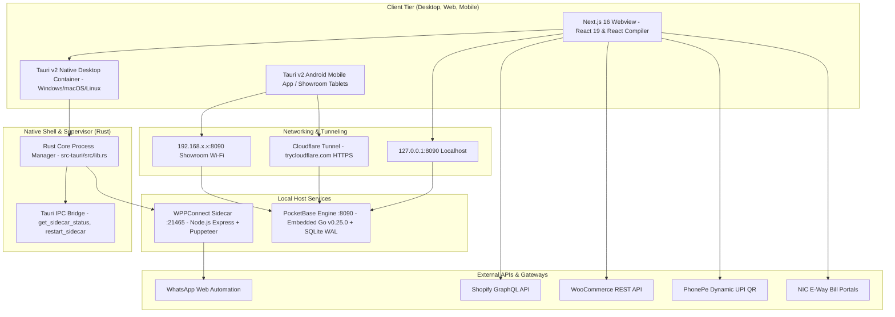
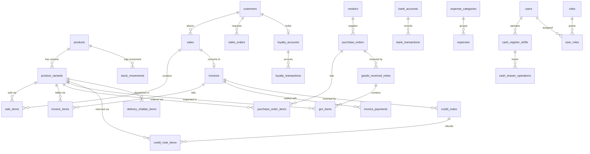

# Luminila Inventory Management System — Technical Report

## 1. Executive Summary

Luminila is a fashion jewelry inventory management and Point of Sale (POS) system engineered for retail showrooms, B2B wholesale counters, and multi-channel e-commerce operations. It merges a native desktop container (Tauri v2), an embedded local database (PocketBase v0.25.0 server engine with SQLite in WAL mode, paired with PocketBase JS SDK v0.26.5), a modern responsive web frontend (Next.js 16 + React 19), and background microservices (WPPConnect WhatsApp sidecar).

---

## 2. System Architecture

### 2.1 High-Level Architecture Topology


```mermaid
graph TD
    subgraph Client Tier ["Client Tier (Desktop, Web, Mobile)"]
        A[Next.js 16 Webview - React 19 & React Compiler]
        B[Tauri v2 Native Desktop Container - Windows/macOS/Linux]
        M[Tauri v2 Android Mobile App / Showroom Tablets]
    end

    subgraph Native Shell ["Native Shell & Supervisor (Rust)"]
        C[Rust Core Process Manager - src-tauri/src/lib.rs]
        IPC[Tauri IPC Bridge - get_sidecar_status, restart_sidecar]
    end

    subgraph Service Tier ["Local Host Services"]
        D[WPPConnect Sidecar :21465 - Node.js Express + Puppeteer]
        E[PocketBase Engine :8090 - Embedded Go v0.25.0 + SQLite WAL]
    end

    subgraph Connectivity ["Networking & Tunneling"]
        Loopback[127.0.0.1:8090 Localhost]
        LAN[192.168.x.x:8090 Showroom Wi-Fi]
        Tunnel[Cloudflare Tunnel - trycloudflare.com HTTPS]
    end

    subgraph External Platforms ["External APIs & Gateways"]
        F[Shopify GraphQL API]
        G[WooCommerce REST API]
        H[PhonePe Dynamic UPI QR]
        W[WhatsApp Web Automation]
        GST[NIC E-Way Bill Portals]
    end

    A --> B
    B --> C
    C --> IPC
    C --> D
    M --> LAN
    M --> Tunnel
    A --> Loopback
    Loopback --> E
    LAN --> E
    Tunnel --> E
    D --> W
    A --> F
    A --> G
    A --> H
    A --> GST
```

### 2.2 Technology Stack

- **Frontend**: Next.js 16.1.0 (App Router) + React 19.2.3, TypeScript 5, React Compiler (`babel-plugin-react-compiler`).
- **UI & Styling**: Tailwind CSS v4 (`@tailwindcss/postcss`), `@base-ui/react`, Shadcn UI primitives, `lucide-react`.
- **Desktop & Mobile Container**: Tauri v2.9.x (Rust 2021) supporting Windows (`.msi`/`.exe`), macOS, Linux, and Android (`.apk`).
- **Database Engine**: PocketBase v0.25.0 Server (Embedded Go binary `pocketbase.exe` + SQLite in Write-Ahead Logging `WAL` mode, binding `0.0.0.0:8090`).
- **Client SDK**: PocketBase JS SDK (`pocketbase ^0.26.5`) with dynamic runtime URL switching (`src/lib/pocketbase.ts`).
- **Messaging Sidecar**: WPPConnect Server (`@wppconnect-team/wppconnect ^2.3.3`) running on Express (port 21465), compiled via `pkg` for native Tauri bundling.
- **Barcodes & Imaging**: `jsbarcode` (vector Code128 generation), `html5-qrcode` (camera barcode scanning).
- **Spreadsheets & Data**: `exceljs`, `jszip` for bulk catalog import/export and XLSX report generation.
- **Payments & Logistics**: PhonePe UPI dynamic QR generation, NIC E-Way Bill JSON generation.

### 2.3 Key Architectural Decisions

1. **Local-First Embedded Database over Cloud Database**:
   - Replaced cloud-hosted databases with **PocketBase** (embedded SQLite in WAL mode).
   - Eliminates ongoing cloud hosting costs, prevents offline showroom checkout blockage when internet drops, and guarantees sub-millisecond local query latencies.
2. **Tauri v2 over Electron**:
   - Reduces the installer bundle footprint from 150MB+ down to <30MB by utilizing OS-native WebViews (Edge WebView2 on Windows).
   - Provides native memory efficiency and supervisor capabilities in Rust (supervising the WPPConnect sidecar).
3. **Dynamic Network Gateway Architecture**:
   - Mobile and multi-terminal devices dynamically repoint `pb.baseUrl` via `localStorage.getItem("PB_CUSTOM_URL")` to showroom LAN IPs (`192.168.x.x:8090`) or Cloudflare Zero-Trust tunnels (`trycloudflare.com`).
4. **Decentralized Offline Mutation Queue & Cloud Sync**:
   - Client mutations are persisted to an offline queue (`src/lib/offline-queue.ts`) with automatic replay upon reconnection.
   - Tier 2 sync logs incremental changes with Google Drive client scaffold (`src/lib/google-drive-sync.ts`) for serverless multi-device synchronization (Beta / Scaffold with offline queue).

---

## 3. Core Subsystems

### 3.1 Native Container & Sidecar Supervisor (Rust)

The Rust native entrypoint (`src-tauri/src/lib.rs`) supervises the entire runtime:

```rust
// src-tauri/src/lib.rs
#[tauri::command]
async fn get_sidecar_status() -> Result<serde_json::Value, String> {
    let is_running = SIDECAR_RUNNING.load(Ordering::SeqCst);
    let is_healthy = if is_running { check_sidecar_health().await } else { false };
    Ok(serde_json::json!({ "running": is_running, "healthy": is_healthy }))
}

#[tauri::command]
async fn restart_sidecar(app: tauri::AppHandle) -> Result<String, String> {
    SIDECAR_RUNNING.store(false, Ordering::SeqCst);
    tokio::time::sleep(Duration::from_secs(2)).await;
    match start_sidecar(&app) {
        Ok(_) => Ok("Sidecar restarted".to_string()),
        Err(e) => Err(e),
    }
}
```

The Rust supervisor maintains an asynchronous background loop testing `http://127.0.0.1:21465/health` every 5 seconds, automatically respawning the sidecar process if three consecutive health checks fail.

### 3.2 Database Access & Dynamic Connection Tier (`src/lib/pocketbase.ts`)

```typescript
// src/lib/pocketbase.ts
export function getPocketBaseUrl(): string {
    if (typeof window !== "undefined") {
        const customUrl = localStorage.getItem("PB_CUSTOM_URL");
        if (customUrl && customUrl.trim()) {
            return customUrl.trim().replace(/\/+$/, "");
        }
    }
    return (process.env.NEXT_PUBLIC_POCKETBASE_URL || 'http://127.0.0.1:8090').replace(/\/+$/, "");
}

export const pb = new PocketBase(getPocketBaseUrl());
pb.autoCancellation(false);

export async function checkServerStatus(targetUrl?: string): Promise<ServerHealthResult> {
    const urlToCheck = (targetUrl || pb.baseUrl).replace(/\/+$/, "");
    const startTime = Date.now();
    try {
        const testClient = targetUrl ? new PocketBase(urlToCheck) : pb;
        const health = await testClient.health.check();
        return { ok: health.code === 200, url: urlToCheck, latencyMs: Date.now() - startTime };
    } catch (err: any) {
        return { ok: false, url: urlToCheck, error: err?.message || "Connection refused" };
    }
}
```

### 3.3 Mobile & Responsive Navigation Tier

To enable showroom floor staff to operate on Android smartphones and tablets:
- **`src/hooks/use-viewport.ts`**: Real-time form factor detection (`isMobile`, `isTablet`, `isDesktop`, `isTauri`, `isAndroid`).
- **`src/components/layout/MobileBottomNav.tsx`**: Bottom thumb bar with elevated Point of Sale (POS) Floating Action Button.
- **`src/components/layout/MobileDrawer.tsx`**: Slide-over navigation grouping 17 ERP modules across Sales, Inventory, Finance, and Showroom.
- **`src/lib/mobile-scanner.ts`**: Unified hardware USB/Bluetooth barcode scanner listener (keyboard wedge) and HTML5 camera scanner.
- **`src/lib/mobile-printer.ts`**: Android system print spooler integration and ESC/POS thermal receipt formatting for 58mm/80mm wireless Bluetooth printers.

### 3.4 Conversational CRM Bridge (`src/lib/whatsapp-crm.ts`)

Implements Phase 1 of the WhatsApp ERP/CRM specification ([`docs/WHATSAPP_ERP_CRM_SPECIFICATION.md`](WHATSAPP_ERP_CRM_SPECIFICATION.md)):
- **Contact resolution**: Inbound chat ids are matched against `vendors` then `customers` using E.164-normalized phones; unknown numbers become CRM leads automatically.
- **Persistent transcripts**: Sidecar chats/messages are mirrored into `whatsapp_chats` / `whatsapp_messages` with unread counts, delivery status, and staff attribution prefixes on outbound messages.
- **Context actions**: Role-aware right-click (desktop) / long-press (mobile, 40 ms haptic) action menus drive vendor ingestion (smart extraction → product + variant + stock movement + draft GRN → `label_print_queue` barcode tags) and customer commerce (smart SKU detection → live POS cart broadcast via `BroadcastChannel('pos_cart')`).
- **Checkout dispatch**: `POSWhatsAppWidget` verifies the customer's WhatsApp account, auto-sends branded GST receipts on checkout, and creates Razorpay payment links that are recorded in the `payment_links` ledger.

---

## 4. Database Schema: 44 Relational Collections

PocketBase manages SQLite in `WAL` mode across **44 relational collections** — 38 core collections created by `src/scripts/init-pocketbase.ts` plus 6 conversational-commerce collections created by `src/scripts/update-whatsapp-crm-schema.ts`:


```mermaid
erDiagram
    products ||--o{ product_variants : "has variants"
    products ||--o{ stock_movements : "logs movement"
    product_variants ||--o{ sale_items : "sold via"
    product_variants ||--o{ invoice_items : "billed via"
    product_variants ||--o{ purchase_order_items : "ordered via"
    product_variants ||--o{ grn_items : "inspected in"
    product_variants ||--o{ credit_note_items : "returned via"
    product_variants ||--o{ delivery_challan_items : "dispatched in"

    sales ||--o{ sale_items : "contains"
    sales ||--o| invoices : "converts to"
    customers ||--o{ sales : "places"
    customers ||--o{ sales_orders : "requests"
    customers ||--o| loyalty_accounts : "holds"
    loyalty_accounts ||--o{ loyalty_transactions : "accrues"

    vendors ||--o{ purchase_orders : "supplies"
    purchase_orders ||--o{ purchase_order_items : "lists"
    purchase_orders ||--o{ goods_received_notes : "received by"
    goods_received_notes ||--o{ grn_items : "contains"

    invoices ||--o{ invoice_items : "bills"
    invoices ||--o{ invoice_payments : "settled with"
    invoices ||--o{ credit_notes : "reversed by"
    credit_notes ||--o{ credit_note_items : "refunds"

    bank_accounts ||--o{ bank_transactions : "records"
    expense_categories ||--o{ expenses : "groups"

    users ||--o{ cash_register_shifts : "operates"
    cash_register_shifts ||--o{ cash_drawer_operations : "tracks"
    users ||--o{ user_roles : "assigned"
    roles ||--o{ user_roles : "grants"
```

### Schema Sub-Domains (42 Custom Collections)
1. **Catalog & Stock**: `products`, `product_variants`, `stock_movements`.
2. **POS & Register**: `sales`, `sale_items`, `cash_register_shifts`, `cash_drawer_operations`.
3. **GST Invoicing & Orders**: `invoices`, `invoice_items`, `invoice_payments`, `number_sequences`, `sales_orders`, `sales_order_items`.
4. **Procurement**: `vendors`, `purchase_orders`, `purchase_order_items`, `goods_received_notes`, `grn_items`.
5. **Returns & Logistics**: `credit_notes`, `credit_note_items`, `delivery_challans`, `delivery_challan_items`.
6. **CRM & Loyalty**: `customers`, `customer_interactions`, `loyalty_settings`, `loyalty_tiers`, `loyalty_accounts`, `loyalty_transactions`.
7. **Treasury & Expenses**: `bank_accounts`, `bank_transactions`, `expense_categories`, `expenses`.
8. **Governance & Settings**: `roles`, `user_roles`, `activity_logs`, `discounts`, `discount_usage`, `store_settings` *(Note: PocketBase also includes the built-in `users` auth collection).*
9. **Conversational Commerce (WhatsApp CRM)**: `whatsapp_chats`, `whatsapp_messages`, `payment_links`, `label_print_queue`, `broadcast_messages`, `whatsapp_opt_outs` — created by `update-whatsapp-crm-schema.ts` and consumed by `src/lib/whatsapp-crm.ts`, `payment-reconciliation.ts`, and `whatsapp-broadcast.ts`.

---

## 5. Development & Production Build Pipelines

### 5.1 Local Development Commands
```bash
# Unified multi-service launcher (PocketBase 0.0.0.0:8090, Sidecar :21465, Next.js :3000)
npm run dev
# or:
npm run dev:all

# Frontend standalone development (Next.js :3000 only)
npm run dev:frontend

# Desktop application development (Tauri v2)
npm run tauri:dev

# Mobile Android application development
npx tauri android dev

# Cloudflare Zero-Trust Tunnel (remote mobile access to 0.0.0.0:8090)
npm run tunnel
```

### 5.2 Production Compilation Pipelines
1. **Frontend Static Export**: `npm run build` generates static HTML/JS into `out/` with React Compiler optimization.
2. **WPPConnect Sidecar**: `cd wppconnect-sidecar && npm run build` compiles `server.js` using `pkg` (`npx pkg`) to `src-tauri/binaries/wppconnect-server-<triple>.exe`.
3. **Desktop Windows Installer**: `npm run tauri:build` packages `luminila.exe` and MSI/NSIS setup bundles.
4. **Android APK**: `npx tauri android build --apk` packages debug and release APKs.

---

## 6. Security & Performance

### 6.1 Security Measures
- **PocketBase JWT Auth**: Cryptographically signed JSON Web Tokens with client-side localStorage persistence.
- **RBAC Matrix**: Role-based access control (`Admin`, `Manager`, `Staff`, `Cashier`, `Viewer`) with permission guards protecting sensitive views.
- **PIN & QR Fast Cashier Switching**: Roadmap item scheduled for Milestone 3. Current release authenticates users via email/password credentials with session persistence.
- **Tauri Content Security Policy (CSP)**: Protocol-based policy (`connect-src 'self' http: https: ws: wss:`) allowing local service loopback and encrypted cloud tunnels.

### 6.2 Performance Optimizations
- **SQLite WAL Mode**: Allows concurrent reads from multiple POS terminals while writes are processed sequentially without database locking.
- **Zero Heavy Web Runtimes**: Tauri eliminates Chromium runtime overhead in desktop production, keeping memory usage minimal compared to Electron.
- **Vector Barcode Generation**: Fast client-side vector Code128 rendering via `jsbarcode` without external network requests.
