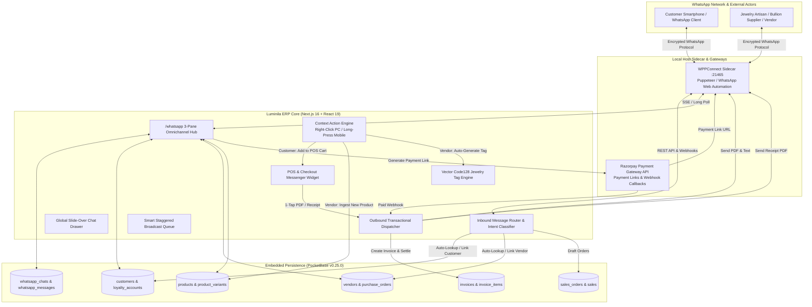
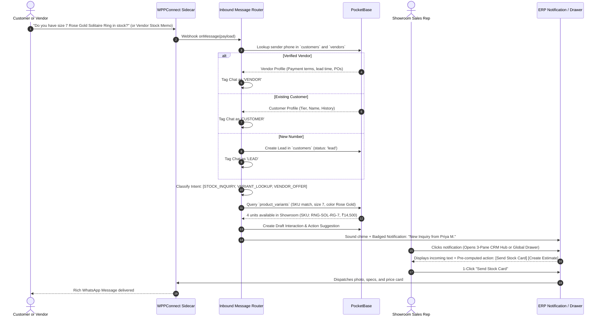
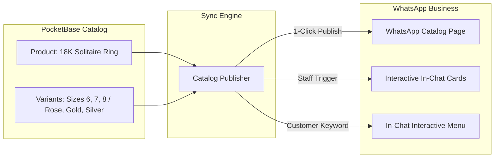
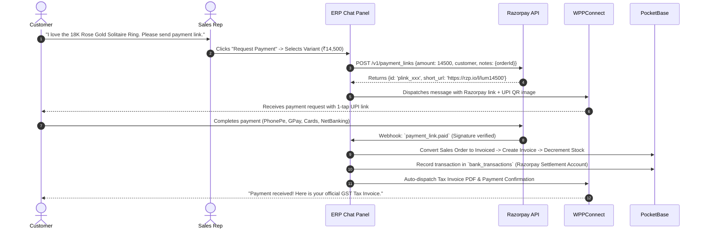
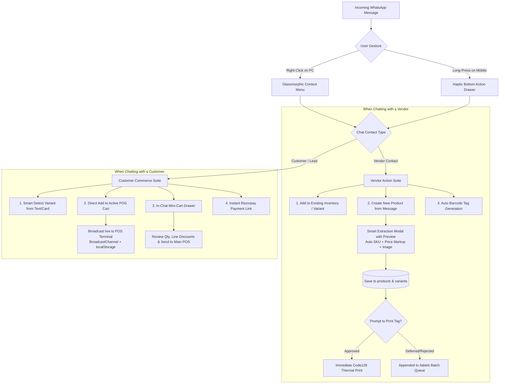
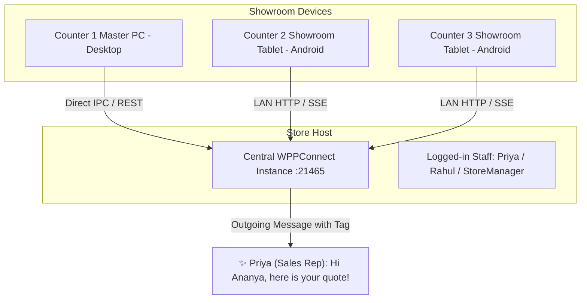

# Luminila WhatsApp to ERP & CRM Feature Specification

> **Status**: Approved Blueprint / Architecture Roadmap  
> **Date**: 2026-09-22  
> **Authors**: Senior Frontend Architect & Avant-Garde UX Engineer  
> **Scope**: WhatsApp Web Sidecar (WPPConnect) ↔ Luminila ERP & CRM Integration

---

## 1. Executive Vision & Architecture Topology

The Luminila WhatsApp subsystem transforms WhatsApp from a simple notification pipe into a **first-class Omnichannel Conversational Commerce & CRM Engine**. It bridges the gap between showroom sales staff, online shoppers, B2B wholesale buyers, and the backend inventory ledger.

### 1.1 High-Level Architecture Topology



---

## 2. Inbound Processing: Two-Tier Pattern / NLP Concierge

Incoming messages are processed through an intelligent two-tier pipeline with **Human-in-the-Loop** verification, ensuring zero hallucinations and eliminating accidental rogue orders.



### Key Capabilities:
1. **Automated Intent Detection**:
   - `STOCK_INQUIRY`: Matches jewelry names, metal tones (Rose Gold, 925 Silver, Yellow Gold), and sizes.
   - `ORDER_STATUS`: Matches order tokens, invoice numbers (`INV-2026-XXXX`), or tracking inquiries.
   - `PRICE_CHECK`: Queries real-time catalog prices with active store discounts.
   - `VENDOR_OFFER`: Identifies wholesale consignments, weights, and karatages from verified suppliers.
   - `TALK_TO_STAFF`: Rings immediate visual alerts on active cashier and staff tablets.
2. **Draft Sales Order Generation**:
   - When a customer says *"Please book 2 pieces of RNG-001 in size 8"*, the router constructs a **Draft Sales Order** in PocketBase without committing inventory.
   - Staff is presented with a 1-click **"Approve & Send Razorpay Link"** banner in the chat window.

---

## 3. Multi-Surface Staff Chat Experience

To ensure staff can assist customers without navigating away from active tasks, WhatsApp messaging is integrated across **three coordinated surfaces**:

```
+---------------------------------------------------------------------------------------+
|  1. Full-Screen Hub (/whatsapp)       |  2. Global Slide-Over Drawer  |  3. POS Popover |
|  - High-volume customer support       |  - Accessible from ANY route  |  - Instant send |
|  - 3-Pane layout with full CRM record |  - Check chat while in inv/PO |  - In-cart chat |
|  - Right-click / Long-press Actions   |  - Gesture-driven workflows   |  - 1-Tap Add    |
+---------------------------------------------------------------------------------------+
```

### 3.1 The 3-Pane Omnichannel CRM Hub (`/whatsapp`)
- **Left Pane (Conversations List)**:
  - Filter tabs: `All`, `Unread`, `Customers`, `Vendors`, `Pending Quotes`, `Leads`.
  - Identity Badges: Color-coded pills designating `Customer` (Emerald), `Vendor` (Indigo), `VIP` (Gold), or `Lead` (Amber).
  - Badges for unread counts, WhatsApp labels (e.g., *Job Work*, *Payment Pending*), and online presence.
  - Search bar filtering by contact name, phone number, vendor company, or recent message text.
- **Center Pane (Active Transcript & Contextual Message Composer)**:
  - Rich chat bubbles with status ticks (Sent, Delivered, Read).
  - **Context Action Engine**: Full support for **Right-Click (PC/Desktop)** and **Long-Press (Android/Mobile)** on any message bubble:
    - Customer message: Instant **"Add to POS Cart"**, **"Create Quote"**, or **"Send Razorpay Link"**.
    - Vendor message: Instant **"Add to Existing Inventory"**, **"Create New Product"**, and **"Auto-Generate Barcode Tag"**.
  - Quick Response Action Bar:
    - 🏷️ **Attach Product Card**: Modal to search jewelry catalog and send an interactive spec card.
    - 💳 **Request Razorpay Payment**: Popover to specify amount and invoice reference.
    - 📄 **Send GST Invoice / Estimate**: Pick from the customer's active invoices.
    - 🏢 **Tag as Vendor / Customer**: 1-click toggle to link contact to `vendors` or `customers`.
    - ⚡ **Canned Templates**: Showroom hours, bank details, return policy, ring sizing guide.
- **Right Pane (Dynamic Customer / Vendor 360° Dossier)**:
  - **When Chatting with a Customer**:
    - Central customer identity (Name, Phone, Email, City, GSTIN).
    - **Loyalty Metric Box**: Current tier badge (`Gold`), points balance, total lifetime spend.
    - **Recent Purchases**: Scrollable timeline of previous POS sales and tax invoices.
    - **Quick Action Buttons**: `[+ New POS Cart]`, `[+ New Estimate]`, `[Edit CRM Profile]`.
  - **When Chatting with a Vendor**:
    - Vendor identity (Company Name, GSTIN, Primary Contact, Lead Time, Payment Terms).
    - **Open Purchase Orders**: Pending POs and incoming consignment status.
    - **Quick Procurement Actions**: `[+ New Purchase Order]`, `[Create GRN]`, `[View Ledger]`.

### 3.2 Global Floating Slide-Over Drawer (`WhatsAppDrawer.tsx`)
- Floating button pinned to the bottom-right of every ERP screen (POS, Inventory, Purchase, Challans, Reports).
- Slides open without page reloads, allowing staff to chat with a customer while inspecting physical stock levels on `/inventory` or verifying a PO in `/purchase`.

### 3.3 POS Checkout Embedded Messenger (`POSWhatsAppWidget.tsx`)
- Integrated into the checkout summary dialog.
- As soon as a cashier enters the customer's phone number:
  - Shows WhatsApp status (Verified WhatsApp account indicator).
  - Checkbox: *"Send Tax Invoice & Receipt via WhatsApp on checkout"* (pre-checked by default).
  - Button: *"Send Razorpay Payment Link to Customer's Phone"*.

---

## 4. Outbound Transactional Suite & Automation Engine

All critical business events in the ERP trigger automated, beautifully formatted transactional dispatches:

| Event Trigger | Source Module | WhatsApp Payload & Format |
|---|---|---|
| **POS Sale Complete** | `/pos` | Formatted greeting + itemized line items + earned loyalty points + **Attached PDF Tax Invoice** |
| **Sales Order Confirmed** | `/orders` | Formal order confirmation with estimated dispatch date & order token |
| **Delivery Challan Dispatched** | `/challan` | Transporter details, vehicle number, dispatch photo, and E-Way bill summary |
| **Credit Note Approved** | `/returns` | Return acceptance notice + **Attached PDF Credit Note** + updated store credit balance |
| **Vendor Purchase Order** | `/purchase` | 1-Click PO dispatch to vendor with **Attached Purchase Order PDF** and delivery SLA |
| **Loyalty Tier Upgrade** | System Engine | Congratulatory message celebrating tier progression (`Silver` → `Gold`) + perk summary |
| **Customer Birthday / Anniversary** | CRM Cron | Personalized greeting + unique discount voucher code (`LUM-BDAY-15`) |

---

## 5. Document Delivery & Media Formatting

To ensure high readability and formal compliance, all documents use a **Hybrid Delivery Specification**:

### 5.1 Format Structure
1. **Header**: Clean jewelry branding (`✨ LUMINILA JEWELRY ✨`).
2. **Greeting**: Personalized with customer name and greeting.
3. **Transaction Summary**:
   - Document ID: `INV-2026-0842`
   - Date & Time: `22-Sep-2026 18:30`
   - Total Amount: `₹28,500.00`
   - Payment Mode: `Paid via Razorpay UPI`
4. **Itemized Snippet**: Top line items with metal purity and variant details.
5. **Loyalty Summary**: *"You earned 285 points with this purchase! Total balance: 1,420 pts."*
6. **Attachment**: Official high-resolution PDF document generated client-side and dispatched as a native WhatsApp file attachment (`application/pdf`).

---

## 6. WhatsApp Business Catalog & In-Chat Showcase

Bridging Luminila's 38-collection database with WhatsApp's product discovery capabilities:



### 6.1 Three-Way Showcase Features
1. **Selective 1-Click Catalog Publishing**:
   - In `/inventory`, staff can toggle `Show in WhatsApp Catalog`.
   - Generates WhatsApp-compatible images, price tags, and variant descriptions.
2. **Interactive In-Chat Rich Media Cards**:
   - Sales reps can click `Send Product Card` in the chat panel.
   - Drops a card containing:
     - High-resolution jewelry photo.
     - Title, SKU, metal purity (e.g., *18K Hallmarked Rose Gold*).
     - Live showroom stock status (*"3 pieces available in store"*).
     - Price and **"Buy Now via Razorpay"** button.
3. **Interactive In-Chat Category Menu Browser**:
   - Customer texts `"Catalog"` or `"Menu"`.
   - Bot responds with an interactive WhatsApp List Message:
     - 💍 Rings (Solitaire, Eternity Bands, Cocktail)
     - 📿 Necklaces & Pendants (Chokers, Layered, Daily Wear)
     - ✨ Earrings (Studs, Hoops, Drops, Jhumkas)
     - 💎 Bracelets & Bangles
   - Tapping any category displays top products with images and pricing.

---

## 7. Remote Payments: Razorpay Payment Links Integration

Remote sales consultations over WhatsApp are settled securely via **Razorpay Payment Links**:



### Key Highlights:
- **Instant 1-Tap UPI Settlement**: Customer taps the link and pays directly via PhonePe, GPay, Paytm, or Credit/Debit cards.
- **Automated Webhook Reconciliation**: Eliminates the need for cashiers to manually check bank statements or request transaction screenshots.
- **Zero Ledger Discrepancy**: Payment automatically creates an `invoice_payments` entry, updates the invoice status to `paid`, and writes a double-entry debit to the `Razorpay Clearing Account` in `/banking`.

---

## 8. In-Chat Context Actions: Right-Click & Long-Press Operations

To empower sales reps and inventory clerks to work at maximum velocity directly within the WhatsApp sidecar/chat window, Luminila introduces **Contextual Gesture Actions**:
- **On PC Desktop**: HTML5 `onContextMenu` (Right-Click) suppressing the browser's default menu to present a sleek glassmorphic command palette.
- **On Mobile Devices (Android / Tablets)**: `onTouchStart` + `500ms` duration threshold with `<10px` movement tolerance, firing a 40ms haptic feedback pulse (`navigator.vibrate?.(40)`), a radial press ripple, and sliding up a native bottom-sheet drawer.



### 8.1 Vendor Identification & Tagging
1. **Auto-Match by Phone**: Inbound numbers are automatically matched against PocketBase `vendors.phone` (normalizing E.164 format). If matched, the chat header and conversation item display an **Indigo 'Vendor' Badge** with the supplier's trading name.
2. **1-Click Header & Context Toggle**: Staff can toggle any conversation between `Customer`, `Vendor`, and `Lead` via a 1-click header pill or by right-clicking the contact in the conversations list.
3. **Contact Card Designation**: Right-clicking or long-pressing a contact brings up **"Mark as Supplier / Vendor"**, opening a fast-entry drawer to assign company GSTIN, payment terms (e.g. Net 30), and lead time. This seamlessly synchronizes with `/vendors` in the ERP.

### 8.2 In-Chat Vendor Ingestion: Message → Inventory & Auto Barcode Tag
When a vendor messages with new jewelry consignments, wholesale manifests, or sample photos:
1. **Right-Click (PC) / Long-Press (Mobile)** on the vendor's message opens the **Vendor Action Palette**:
   - 📦 **Add to Existing Inventory / Variant**:
     - Fast-track search opens a mini-variant lookup.
     - Staff selects existing variant (e.g., `RNG-SOL-RG-7`), enters received quantity (pre-parsed from text if detected), and confirms cost price.
     - Automatically creates a `stock_movements` record (type: `purchase_receipt`), increments `product_variants.stock_level`, and generates a draft GRN in `/purchase`.
   - 💎 **Create New Product from Message**:
     - **Smart Extraction Modal with Human-in-the-Loop**:
       - Media photo is automatically downloaded via WPPConnect and set as the primary product image.
       - Natural language parser extracts metal purity (e.g. *18K*), category (*Choker / Ring*), net weight (*14.2g*), and vendor cost price (*₹42,000*).
       - Automatically computes suggested retail price based on showroom margin settings.
       - **Auto SKU Generation**: Generates standard SKU (e.g. `VND-CHK-18K-001`).
       - Staff verifies or adjusts fields in the modal and clicks **"Approve & Ingest"**.
       - Saves new records in `products` and `product_variants` in PocketBase.
   - 🏷️ **Auto Barcode Tag Generation**:
     - Immediately upon product approval, the system generates a vector Code128 barcode configured for jewelry dumbbell/butterfly barbell labels (containing SKU, Net Wt, Purity, and Retail Price).
     - **Prompt to Print**: A floating prompt asks *"Print Barcode Tag Now?"*.
       - If **Approved**: Dispatches immediately to the default thermal label printer.
       - If **Deferred/Rejected**: Automatically saves and queues the tag into `/labels` for end-of-day batch printing.

### 8.3 In-Chat Customer Commerce: Message → Direct "Add to POS Cart"
When chatting with customers inquiring about items, custom orders, or purchasing:
1. **Right-Click (PC) / Long-Press (Mobile)** on any customer inquiry or replied product card brings up the **Customer Commerce Palette**:
   - 🛒 **Add to POS Cart**:
     - **Smart Detection**: If the message quotes an existing product card or contains an SKU/keyword, the variant is pre-selected.
     - **1-Click Variant Picker**: If ambiguous (e.g., *"I want the rose gold ring"*), a compact variant picker pops up to select Ring Size (6/7/8) or Metal Finish.
     - **Live Broadcast to POS Terminal**: Pushes the selected item directly into the active Point of Sale terminal cart via `BroadcastChannel('pos_cart')` and localStorage events (`pos:cart-updated`).
     - Cashier standing at the showroom terminal instantly sees the cart update with a toast: *"Added 1x RNG-SOL-RG-7 from WhatsApp chat with Priya M."*
   - 🛍️ **In-Chat Mini-Cart Drawer**:
     - Staff can open a slide-out mini-cart right inside the WhatsApp panel to review staged items, adjust quantities, apply custom line-item discounts, and view live subtotal + GST.
     - Buttons:
       - `[Send to Main POS Counter]`: Transmits cart to physical showroom checkout.
       - `[Generate Razorpay Payment Link]`: Converts the staged mini-cart directly into a 1-tap remote payment link sent back into the chat.
       - `[Save as Wholesale Estimate]`: Exports as a formal quote in `/orders`.

### 8.4 Cross-Platform Interaction Design
- **Desktop (PC / Mac)**:
  - Event: `onContextMenu` listener bound to each `.message-bubble`.
  - Behavior: `e.preventDefault()`, captures `(clientX, clientY)`, renders `<GlassmorphicContextMenu />` with keyboard navigation (`Esc` to close, arrow keys, `Enter` to select).
- **Mobile (Android Tablet / Smartphone)**:
  - Event: `onTouchStart` starts 500ms timeout timer. If finger moves `> 10px` (`onTouchMove`), timer cancels to allow scrolling.
  - On timeout: triggers `navigator.vibrate?.(40)` for tactical haptic feedback, renders a radial ripple animation over the message bubble, and slides up a `<BottomSheetDrawer />` with large thumb-friendly action buttons.

---

## 9. CRM Customer Linking, Lead Management & De-duplication

- **E.164 Normalization**: Every phone number is sanitized to E.164 standard (`+91XXXXXXXXXX`), stripping spaces, dashes, and leading zeros.
- **Automatic Profile Resolution**:
  - If the number exists in `customers`, the conversation immediately binds to their profile, displaying customer lifetime value (LTV), credit balance, and loyalty tier.
  - If the number exists in `vendors`, it binds to the supplier dossier.
  - If the number is not recognized, a new record is created with `status: 'lead'` and `lead_source: 'whatsapp'`.
- **1-Click Profile Enrichment**:
  - Staff can update the customer's or vendor's name, email, billing address, and GSTIN directly from the chat sidebar.
  - Changes instantly synchronize to PocketBase.

---

## 10. Multi-Terminal Session Architecture & Staff Attribution

In multi-counter jewelry showrooms, multiple staff members share the official store WhatsApp line:



### Features:
1. **Centralized Store Gateway**: A single paired WhatsApp Business account runs on the host PC, ensuring that all communications originate from the verified store number.
2. **Staff Attribution Tags**: Outgoing messages typed by staff are transparently prefixed with their name (e.g. `[Priya - Luminila Sales]`), ensuring personal accountability and building customer rapport.
3. **Floor Sales Rep Fallback**: If the central sidecar is temporarily offline or undergoing pairing, mobile tablets can seamlessly launch native Android `wa.me/` intents directly to the customer's chat.

---

## 11. Marketing Campaigns & Anti-Ban Safeguards

To prevent Meta account restrictions during festival promotions and seasonal campaigns:

### Anti-Ban Engineering Rules:
1. **Humanized Jitter & Throttling**: Outbound marketing messages are queued and dispatched with randomized delays between **8 to 22 seconds** per message, mimicking natural human typing patterns.
2. **Personalized Merge Tags**: Every message is rendered uniquely with customer-specific tokens:
   `"Dear {{customer_name}}, we reserved the {{favorite_category}} pieces you viewed..."`
3. **Audience Segmentation**: Campaigns target strictly opted-in, segmented cohorts (e.g. *Platinum & Gold Tier VIPs*, *Customers with unredeemed loyalty points > 500*).
4. **Daily Volume Quotas**: Automatic hard stops at **150 messages/day** per WhatsApp session for unsolicited marketing, with zero limits on customer-initiated inbound support replies and transactional receipts.
5. **Opt-Out Compliance**: Every campaign includes a polite opt-out footer (*"Reply STOP to opt out"*). Detecting the word `STOP` automatically flags `whatsapp_opt_out: true` in the customer's CRM profile.

---

## 12. Schema Extensions for PocketBase

To support this comprehensive specification, the following schema additions will be introduced into `src/scripts/init-pocketbase.ts`:

### 12.1 New Collections
1. **`whatsapp_chats`**:
   - `chat_id` (string, unique, e.g. `919876543210@c.us`)
   - `contact_type` (`'customer'` | `'vendor'` | `'lead'`, default `'lead'`)
   - `customer` (relation -> `customers`, optional)
   - `vendor` (relation -> `vendors`, optional)
   - `last_message_body` (text)
   - `last_message_time` (datetime)
   - `unread_count` (number)
   - `status` (`'active'` | `'archived'` | `'pending_quote'`)
   - `assigned_staff` (relation -> `users`, optional)
   - `labels` (json array of strings)
2. **`whatsapp_messages`**:
   - `chat` (relation -> `whatsapp_chats`)
   - `message_id` (string, unique)
   - `from_me` (bool)
   - `sender_name` (string)
   - `staff_user` (relation -> `users`, optional)
   - `body` (text)
   - `message_type` (`'text'` | `'image'` | `'document'` | `'product_card'` | `'payment_link'`)
   - `media_url` (text, optional)
   - `status` (`'pending'` | `'sent'` | `'delivered'` | `'read'` | `'failed'`)
3. **`payment_links`**:
   - `provider` (`'razorpay'` | `'phonepe'`)
   - `link_id` (string, unique)
   - `short_url` (string)
   - `amount` (number)
   - `currency` (string, default `'INR'`)
   - `customer` (relation -> `customers`)
   - `order` (relation -> `sales_orders`, optional)
   - `invoice` (relation -> `invoices`, optional)
   - `status` (`'created'` | `'paid'` | `'expired'` | `'cancelled'`)
   - `paid_at` (datetime)
   - `payment_id` (text, e.g. `pay_xxx`)
4. **`label_print_queue`**:
   - `variant` (relation -> `product_variants`)
   - `quantity` (number, default 1)
   - `template` (`'dumbbell'` | `'butterfly'` | `'sheet'`)
   - `status` (`'pending'` | `'printed'` | `'cancelled'`)
   - `created_by` (relation -> `users`, optional)
5. **`broadcast_messages`** (spec §11 anti-ban queue):
   - `campaign` (text, required)
   - `customer` (relation -> `customers`, optional)
   - `recipient_phone` (text, required, E.164)
   - `body` (text, merge-tag rendered)
   - `status` (`'queued'` | `'sent'` | `'failed'` | `'skipped'`)
   - `scheduled_at` (datetime, jittered slot)
   - `sent_at` (datetime)
   - `error` (text)
   - `created_by` (relation -> `users`, optional)
6. **`whatsapp_opt_outs`** (spec §11.5 STOP compliance):
   - `phone` (text, required, unique index)
   - `customer` (relation -> `customers`, optional)
   - `reason` (text, e.g. `'stop'` | `'manual'`)
   - `created_at` (datetime)

---

## 13. Implementation Status & Audit History

| Phase | Description | Status | Audit Document |
|---|---|---|---|
| **Phase 1** | Core Hub & Context Gestures (3-pane layout, PC right-click context menu, mobile long-press with 40ms haptics, vendor message ingestion, auto-barcode generation & print queue, POS broadcast) | **COMPLETED & VERIFIED** | [`docs/WHATSAPP_CRM_CODE_AUDIT_2026-09-22.md`](file:///e:/Local_GIT_2/luminila_inv_mgmt/docs/WHATSAPP_CRM_CODE_AUDIT_2026-09-22.md) |
| **Phase 2** | Remote Payments & Accounting Reconciliation (Razorpay payment link modal, polling reconciler, automatic sales order & invoice settlement, clearing account double-entry ledger, loyalty point crediting, WhatsApp invoice auto-dispatch) | **COMPLETED & HARDENED** | [`docs/WHATSAPP_PHASE2_PHASE3_AUDIT_2026-09-22.md`](file:///e:/Local_GIT_2/luminila_inv_mgmt/docs/WHATSAPP_PHASE2_PHASE3_AUDIT_2026-09-22.md) |
| **Phase 3** | WhatsApp Catalog Showcases & Smart Broadcasts (WhatsApp Business catalog sync, in-chat rich media product cards, staggered broadcast queue with 8–22s jitter, merge tags `{{customer_name}}`/`{{first_name}}`/`{{tier}}`/`{{loyalty_points}}`/`{{total_spent}}`, 150/day marketing quota, and STOP opt-out registry) | **COMPLETED & HARDENED** | [`docs/WHATSAPP_PHASE2_PHASE3_AUDIT_2026-09-22.md`](file:///e:/Local_GIT_2/luminila_inv_mgmt/docs/WHATSAPP_PHASE2_PHASE3_AUDIT_2026-09-22.md) |

---

*This document serves as the official approved design blueprint and verification record for the Luminila WhatsApp-to-ERP/CRM enhancement milestone.*
